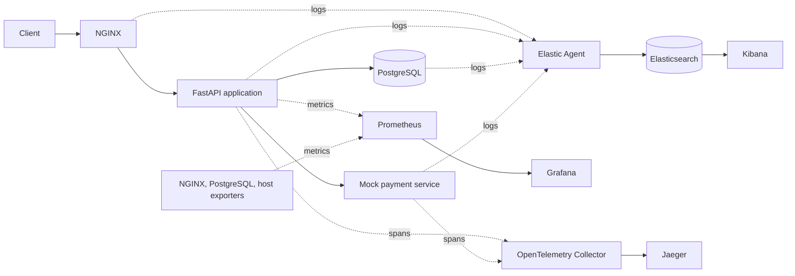

# ShopSphere Observability Lab

A hands-on learning project for understanding how logs, metrics, and distributed
traces help explain the behavior of an e-commerce application.

**Current milestone: Phase 1 — repository structure and learning documentation.**
Application code, container configuration, and running telemetry arrive in later
phases. There is no runnable service or Docker Compose file yet.

The original project brief is preserved in
[docs/implementation-spec.md](docs/implementation-spec.md).

## 1. Project Motivation

An alert saying “checkout is slow” does not explain why. This lab will build a
small system where you can find the slowdown in a metric, examine related logs,
and follow the request through a trace to the database or payment service.

We will implement one phase at a time. Each phase will explain its concepts,
introduce files, verify the result, update the guide and learning journal, and
make a focused Git commit.

| Phase | Deliverable | Status |
| --- | --- | --- |
| 1 | Repository structure and learning documentation | Complete |
| 2 | FastAPI e-commerce service and application logging | Planned |
| 3 | PostgreSQL persistence and slow-query exercises | Planned |
| 4 | NGINX reverse proxy and request logging | Planned |
| 5 | Docker images and a runnable Docker Compose application | Planned |
| 6 | Centralized logs with Elastic Agent, Elasticsearch, and Kibana | Planned |
| 7 | Prometheus metrics, exporters, and Grafana dashboards | Planned |
| 8 | OpenTelemetry instrumentation, Collector, and Jaeger | Planned |
| 9 | Correlation exercises across logs, metrics, and traces | Planned |

## 2. Observability Concepts

| Signal | What it records | Question it helps answer |
| --- | --- | --- |
| Logs | Individual events with timestamps and context | What happened during this request? |
| Metrics | Numeric measurements over time | Are requests getting slower or failing more often? |
| Traces | Related timed operations, called spans, within a request | Which operation consumed the time? |

These signals complement each other. A latency metric can reveal a trend; a
trace can locate a slow database call; a log can explain an error from that call.
Later phases will attach trace IDs to application logs to connect the evidence.

For Phase 1, focus on the foundation: a repository is the shared record of source
code, service configuration, and operating knowledge. Read the
[Phase 1 learning notes](docs/learning-notes.md#phase-1-repository-foundations)
before moving on.

## 3. Architecture Diagram

The diagram describes the **target system**, not services that currently run.



Solid request arrows show service calls; telemetry arrows show data movement.
Prometheus initiates scrapes even though metrics flow toward Prometheus.
Database-call spans will be generated by instrumentation in the application.
See [architecture.md](docs/architecture.md) for boundaries and design notes.

The current workspace is the repository root; no extra nested project directory
is needed. Each service directory contains a README explaining its future role.

```text
METRICLOGTRACES/
├── .editorconfig
├── .gitattributes
├── .gitignore
├── README.md
├── app/                     # FastAPI application
├── payment/                 # Separate mock service for distributed calls
├── nginx/                   # Reverse proxy configuration
├── postgres/                # Database initialization and logging configuration
├── elastic/                 # Elastic Agent log collection configuration
├── elasticsearch/           # Log storage configuration and notes
├── kibana/                  # Log exploration configuration and notes
├── prometheus/              # Scrape configuration
├── grafana/
│   ├── README.md
│   └── dashboards/          # Versioned dashboard definitions
├── otel/                    # OpenTelemetry Collector configuration
├── jaeger/                  # Trace storage and exploration configuration
└── docs/
    ├── architecture.md
    ├── implementation-spec.md
    ├── learning-journal.md
    ├── learning-notes.md
    └── troubleshooting.md
```

Files such as `app/main.py`, `app/Dockerfile`, and `docker-compose.yml` will be
introduced in the phases that implement them.

## 4. Request Lifecycle

The planned checkout path is:

1. A client sends a request to NGINX.
2. NGINX forwards it to FastAPI.
3. FastAPI validates the request and performs database operations.
4. When payment is needed, FastAPI calls the mock payment service over HTTP.
5. The response returns through NGINX to the client.

Later instrumentation will record timings, outcomes, and related events along
this path. A payment service in its own process lets us practice passing trace
context across a real service boundary.

## 5. Logging Pipeline

**Planned in Phase 6:** application, NGINX, and PostgreSQL logs → Elastic Agent →
Elasticsearch → Kibana.

Applications will emit structured JSON logs. Elastic Agent will collect and
prepare log events; Elasticsearch will index them for search; Kibana will provide
the interface for investigating them. NGINX and database log formats will be
configured and parsed explicitly during implementation.

## 6. Metrics Pipeline

**Planned in Phase 7:** application `/metrics` and infrastructure exporters →
Prometheus → Grafana.

Prometheus will periodically request, or scrape, metric endpoints. Exporters
translate measurements from systems such as PostgreSQL into a format Prometheus
understands. Grafana will query those stored time series to display request
rates, latency, errors, database activity, and host resource usage.

The application metric families will include `http_requests_total`,
`http_request_duration_seconds`, `database_query_duration_seconds`, and
`application_errors_total`.

## 7. Tracing Pipeline

**Planned in Phase 8:** OpenTelemetry SDKs in the application and payment service
→ OpenTelemetry Collector → Jaeger.

A span represents one operation. Related spans form a trace. Trace context
passed in HTTP headers connects the application request to the payment request.
Database client instrumentation records SQL operations as spans in the same
trace. The Collector receives and forwards spans; Jaeger lets us inspect them.

A parent request waiting for a five-second database call must last at least as
long as that call. If application work adds about 500 ms, the total is about
5.5 seconds for sequential work, not 500 ms. The original brief's timing example
will be interpreted this way when implementing the slow-query exercise.

## 8. Installation

For Phase 1, only Git and a text editor are required. From this repository root:

```bash
git status
git log --oneline
```

The first command shows changes relative to Git's recorded state. The second
shows the project's committed milestones. No Python dependencies or containers
need to be installed for this phase.

Docker Engine with the Compose plugin will be required in Phase 5. Versions,
machine requirements, and installation checks will be documented when the
runtime stack is added and verified.

## 9. Running the System

There is no runtime in Phase 1. The future startup command is
`docker compose up`, after the Compose file is implemented in Phase 5.

For now, inspect the directory guide, read the learning notes, and use
`git show --stat HEAD` to see what the first milestone introduced.

## 10. Testing Telemetry

Phase 1 verification covers repository structure, documentation links,
formatting, and Git ignore rules. No runtime or telemetry test is possible yet.

Later phases will verify these scenarios with explicit commands and expected
results:

| Request | Planned purpose |
| --- | --- |
| `GET /` | Basic application response |
| `GET /products` | Product listing and database reads |
| `POST /orders` | Order creation and business events |
| `GET /orders/{id}` | Order retrieval |
| `GET /slow-query` | Controlled database delay |
| `GET /error` | Error log, error metric, and failed trace |
| `GET /payment` | HTTP call to the separate mock payment service |
| `GET /metrics` | Prometheus application metrics |

These routes are the implementation plan; none exists yet.

## 11. Debugging Scenarios

The final exercise will be “checkout became slow.” We will introduce a controlled
database delay, find the latency increase in Grafana, locate related events in
Kibana, and inspect the database span in Jaeger. After removing the delay, we will
repeat the request and confirm the improvement in all three signals.

The exercise will connect slow-query behavior to the checkout path in a later
phase, so its evidence describes the same request journey.

## 12. Common Problems

See [troubleshooting.md](docs/troubleshooting.md) for Phase 1 checks, including
working-directory mistakes, Git identity, ignored files, and missing runtime
configuration. Runtime troubleshooting will grow alongside the implementation.

## 13. Production Improvements

This repository will teach production concepts through a local lab. Future
production discussions will cover authentication, TLS, secret management,
telemetry retention, trace sampling, backups, availability, and alerting.
Those capabilities have not been implemented in Phase 1.

## 14. Kubernetes Migration Path

After completing and understanding the Compose lab, we will map service
containers to Kubernetes workloads, networking to Services, and persistent data
to volumes. Then we will discuss Helm packaging, the Prometheus Operator,
Elastic's Kubernetes integration, and a production Jaeger deployment.

Kubernetes is a later learning extension. The next implementation milestone is
**Phase 2: the FastAPI e-commerce service**.
