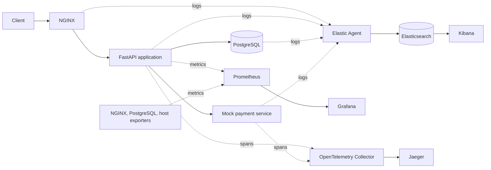

# ShopSphere Observability Lab

A hands-on learning project for understanding how logs, metrics, and distributed
traces help explain the behavior of an e-commerce application.

**Current milestone: Phase 3 — PostgreSQL persistence and SQL observability.**
The Python API stores products and orders in PostgreSQL, which runs in a single
Docker container with persistent storage. Request, business, SQL, and database
logs are available locally. NGINX, full application containerization, centralized
logs, metrics, and distributed tracing arrive in later phases.

The original project brief is preserved in
[docs/implementation-spec.md](docs/implementation-spec.md).

## 1. Project Motivation

An alert saying “checkout is slow” does not explain why. This lab will build a
small system where you can find the slowdown in a metric, examine related logs,
and follow the request through a trace to the database or payment service.

We will implement one phase at a time. Each phase will explain its concepts,
introduce files, verify the result, update the guide and learning journal, and
make a focused Git commit.

| Phase | Deliverable | Status |
| --- | --- | --- |
| 1 | Repository structure and learning documentation | Complete |
| 2 | FastAPI e-commerce service and application logging | Complete |
| 3 | PostgreSQL persistence and slow-query exercises | Complete |
| 4 | NGINX reverse proxy and request logging | Planned |
| 5 | Docker images and a runnable Docker Compose application | Planned |
| 6 | Centralized logs with Elastic Agent, Elasticsearch, and Kibana | Planned |
| 7 | Prometheus metrics, exporters, and Grafana dashboards | Planned |
| 8 | OpenTelemetry instrumentation, Collector, and Jaeger | Planned |
| 9 | Correlation exercises across logs, metrics, and traces | Planned |

## 2. Observability Concepts

| Signal | What it records | Question it helps answer |
| --- | --- | --- |
| Logs | Individual events with timestamps and context | What happened during this request? |
| Metrics | Numeric measurements over time | Are requests getting slower or failing more often? |
| Traces | Related timed operations, called spans, within a request | Which operation consumed the time? |

These signals complement each other. A latency metric can reveal a trend; a
trace can locate a slow database call; a log can explain an error from that call.
Later phases will attach trace IDs to application logs to connect the evidence.

Start with the [repository foundations](docs/learning-notes.md#phase-1-repository-foundations),
then follow the [Phase 2 lesson](docs/phase-02-fastapi.md) to learn HTTP routes,
request validation, process memory, and structured logging. The
[Phase 3 lesson](docs/phase-03-postgresql.md) explains how database transactions,
persistence, and slow-query evidence extend that foundation.

## 3. Architecture Diagram

The diagram describes the **target system**. FastAPI, PostgreSQL, and the mock
payment service are implemented; clients currently connect directly to FastAPI.



Solid request arrows show service calls; telemetry arrows show data movement.
Prometheus initiates scrapes even though metrics flow toward Prometheus.
Database-call spans will be generated by instrumentation in the application.
See [architecture.md](docs/architecture.md) for boundaries and design notes.

The current workspace is the repository root; no extra nested project directory
is needed. Each service directory contains a README explaining its future role.

```text
METRICLOGTRACES/
├── .editorconfig
├── .gitattributes
├── .gitignore
├── README.md
├── requirements.in          # Direct runtime dependencies
├── requirements.txt         # Pinned runtime dependency set
├── requirements-dev.in      # Direct development dependencies
├── requirements-dev.txt     # Pinned test and lint environment
├── pyproject.toml           # Test and lint settings
├── .python-version          # Python 3.12
├── .env.example             # Documented service connection settings
├── app/                     # FastAPI application
├── payment/                 # Separate mock service for distributed calls
├── nginx/                   # Reverse proxy configuration
├── postgres/                # Database initialization and logging configuration
├── elastic/                 # Elastic Agent log collection configuration
├── elasticsearch/           # Log storage configuration and notes
├── kibana/                  # Log exploration configuration and notes
├── prometheus/              # Scrape configuration
├── grafana/
│   ├── README.md
│   └── dashboards/          # Versioned dashboard definitions
├── otel/                    # OpenTelemetry Collector configuration
├── jaeger/                  # Trace storage and exploration configuration
├── tests/                   # API behavior and logging tests
└── docs/
    ├── architecture.md
    ├── implementation-spec.md
    ├── learning-journal.md
    ├── learning-notes.md
    ├── phase-02-fastapi.md
    ├── phase-03-postgresql.md
    └── troubleshooting.md
```

The application now has routes, HTTP schemas, SQLAlchemy models and transactions,
connection configuration, and JSON logging. `postgres/compose.yml` starts only
the database. `app/Dockerfile` and the root `docker-compose.yml` arrive in Phase 5.

## 4. Request Lifecycle

The target checkout path is:

1. A client sends a request to NGINX.
2. NGINX forwards it to FastAPI.
3. FastAPI validates the request and performs database operations.
4. When payment is needed, FastAPI calls the mock payment service over HTTP.
5. The response returns through NGINX to the client.

In Phase 3, `POST /orders` validates and saves an order and its item rows in one
PostgreSQL transaction. It returns 201 only after the commit succeeds. It does
not charge or call payment. `GET /payment` separately demonstrates the HTTP call to
the mock service. Both services log their requests, and the API forwards
`X-Request-ID` to the payment service. This is log correlation, not tracing yet.

## 5. Logging Pipeline

**Planned in Phase 6:** application, NGINX, and PostgreSQL logs → Elastic Agent →
Elasticsearch → Kibana.

The two applications now emit structured JSON logs to stdout. Request events
include a UTC timestamp, service, request ID, route template, status, and duration.
Business events describe order creation and simulated payment approval. Error
events record failures. SQLAlchemy also emits query duration and failure events
with the current request ID. `trace_id` is currently null.

PostgreSQL writes connection, slow-statement, and error events to JSON files in
its data volume. Statements taking at least 250 ms are logged. Validated request
IDs are attached to application SQL as comments, connecting database logs with
the API logs. See the Phase 3 lesson for log inspection commands.

Elastic Agent will collect and
prepare log events; Elasticsearch will index them for search; Kibana will provide
the interface for investigating them. Native PostgreSQL JSON and application JSON
have different field names; collection and normalization arrive in Phase 6.

## 6. Metrics Pipeline

**Planned in Phase 7:** application `/metrics` and infrastructure exporters →
Prometheus → Grafana.

Prometheus will periodically request, or scrape, metric endpoints. Exporters
translate measurements from systems such as PostgreSQL into a format Prometheus
understands. Grafana will query those stored time series to display request
rates, latency, errors, database activity, and host resource usage.

The application metric families will include `http_requests_total`,
`http_request_duration_seconds`, `database_query_duration_seconds`, and
`application_errors_total`.

## 7. Tracing Pipeline

**Planned in Phase 8:** OpenTelemetry SDKs in the application and payment service
→ OpenTelemetry Collector → Jaeger.

A span represents one operation. Related spans form a trace. Trace context
passed in HTTP headers connects the application request to the payment request.
Database client instrumentation records SQL operations as spans in the same
trace. The Collector receives and forwards spans; Jaeger lets us inspect them.

A parent request waiting for a five-second database call must last at least as
long as that call. If application work adds about 500 ms, the total is about
5.5 seconds for sequential work, not 500 ms. The original brief's timing example
is now implemented with the database wait included in the request duration.

## 8. Installation

Use Python 3.12, Git, and a running Docker Engine with the Compose plugin. These
commands are for Bash on Linux or WSL, run from the repository root:

```bash
python3.12 -m venv .venv
.venv/bin/python -m pip install -r requirements-dev.txt
```

If using `uv`, the equivalent is:

```bash
uv venv --python /usr/bin/python3.12 .venv
uv pip sync --python .venv/bin/python requirements-dev.txt
```

The development requirements include the runtime packages, pytest, and Ruff.
For only running the services, install `requirements.txt` instead. The `.in`
files declare direct dependencies; the `.txt` files pin the resolved versions.

For an existing environment from Phase 2, rerun the dependency installation or
`uv pip sync` command to add SQLAlchemy and Psycopg. Verify Docker with
`docker version` and `docker compose version`. PostgreSQL is pinned to
`postgres:18.6-bookworm`; the Dockerized application stack is still Phase 5 work.

## 9. Running the System

Start PostgreSQL and initialize its tables and sample products:

```bash
docker compose -f postgres/compose.yml up -d --wait
.venv/bin/python -m app.database
```

Initialization is explicit and repeatable; it preserves existing products and
orders. It creates missing tables, but does not migrate an existing table's
structure. The default database settings match this local Compose configuration.

Then start the mock payment service in one terminal:

```bash
.venv/bin/python -m uvicorn payment.main:app --host 127.0.0.1 --port 8001 --no-access-log
```

Start the API in a second terminal, also from the repository root:

```bash
.venv/bin/python -m uvicorn app.main:app --host 127.0.0.1 --port 8000 --no-access-log
```

Open [the API documentation](http://127.0.0.1:8000/docs) or try
`curl -i http://127.0.0.1:8000/products`. Stop either server with Ctrl+C.

Orders now survive API and database restarts. API instances share the database,
while each request uses its own SQLAlchemy session. `.env.example` documents
optional overrides; export them in your shell because the Python application
does not load `.env` automatically.

Stop PostgreSQL with `docker compose -f postgres/compose.yml stop`. To remove its
container while keeping orders, use `docker compose -f postgres/compose.yml down`.
The named data volume is retained. Adding `--volumes` would delete that data.

`docker compose up` becomes available in Phase 5.

## 10. Testing Telemetry

Run the checks with Docker available:

```bash
.venv/bin/python -m pytest -q
.venv/bin/python -m ruff check app payment tests
.venv/bin/python -m ruff format --check app payment tests
```

Tests check order behavior, invalid inputs, JSON logs, concurrent request context,
cross-service request IDs, payment failures, persistence, rollback, database
constraints, and slow-query logs. The suite starts and removes its own PostgreSQL
container and creates a fresh database per test. It does not use or erase the lab
database. Python API servers need not be running.

| Request | Current behavior |
| --- | --- |
| `GET /` | Service status and current storage mode |
| `GET /products` | Seeded products read from PostgreSQL, priced in USD cents |
| `POST /orders` | Validate items, calculate prices, store order; return 201 |
| `GET /orders/{id}` | Retrieve an order, or return 404 if missing |
| `GET /slow-query` | Real PostgreSQL delay; default 5 seconds, configurable from 0 to 5 |
| `GET /error` | Intentional 500, error log, and request log |
| `GET /payment` | HTTP simulation; 200 on success, 502/504 on dependency failures |
| `GET /metrics` | Planned for Phase 7; currently absent |

Follow the [Phase 3 walkthrough](docs/phase-03-postgresql.md) to create persistent
orders and inspect SQL and request logs. Uvicorn's own startup messages
remain console text; application events are JSON, one per line.

## 11. Debugging Scenarios

Today, call `/error` and find its matching error and completion events by request
ID. Then stop the payment service and call `/payment`; the API should return 502
and record the dependency failure. The Phase 2 lesson explains both exercises.

Try `GET /slow-query` with `X-Request-ID: phase3-slow`, then find that ID in the
API's SQL event and PostgreSQL's slow-statement log. For a slow checkout, use
`POST /orders?db_delay_seconds=5` with a normal order body. The default order path
has no artificial delay. Both delay parameters reject values outside 0–5 seconds.

The final exercise will be “checkout became slow.” We will use this controlled
database delay, find the latency increase in Grafana, locate related events in
Kibana, and inspect the database span in Jaeger. After removing the delay, we will
repeat the request and confirm the improvement in all three signals.

Removing `db_delay_seconds` removes the injected wait; compare the SQL and request
durations. This is an intentional delay exercise, not a query-index optimization.

## 12. Common Problems

See [troubleshooting.md](docs/troubleshooting.md) for environment, import, payment,
port, database readiness, persistence, and log-location problems.

## 13. Production Improvements

This repository will teach production concepts through a local lab. Future
production discussions will cover authentication, TLS, secret management,
telemetry retention, trace sampling, backups, availability, and alerting.
Those capabilities have not been implemented. The current lab also uses a local
database owner account and an explicit table-creation command. Production needs
separate migration/runtime roles, managed secrets, schema migrations, and a
backup/recovery plan; a persistent Docker volume alone is not a backup.

## 14. Kubernetes Migration Path

After completing and understanding the Compose lab, we will map service
containers to Kubernetes workloads, networking to Services, and persistent data
to volumes. Then we will discuss Helm packaging, the Prometheus Operator,
Elastic's Kubernetes integration, and a production Jaeger deployment.

Kubernetes is a later learning extension. The next implementation milestone is
**Phase 4: NGINX reverse proxy and request logging**.
