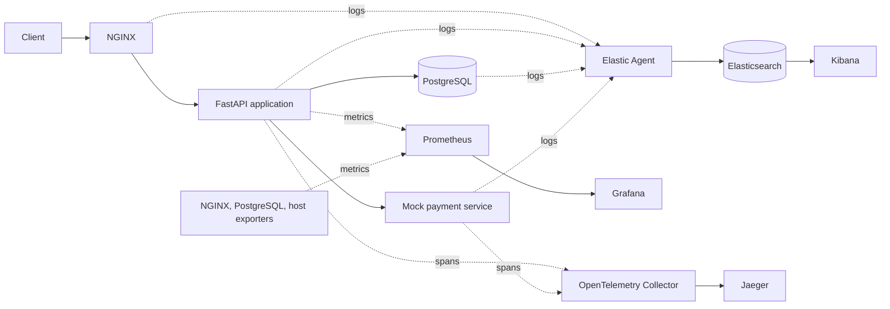

# ShopSphere Observability Lab

A hands-on learning project for understanding how logs, metrics, and distributed
traces help explain the behavior of an e-commerce application.

**Current milestone: Phase 2 — FastAPI services and structured application logs.**
The order API and mock payment service run locally with Python. Orders are stored
in process memory and reset on restart. PostgreSQL, containers, centralized logs,
metrics, and distributed tracing arrive in later phases.

The original project brief is preserved in
[docs/implementation-spec.md](docs/implementation-spec.md).

## 1. Project Motivation

An alert saying “checkout is slow” does not explain why. This lab will build a
small system where you can find the slowdown in a metric, examine related logs,
and follow the request through a trace to the database or payment service.

We will implement one phase at a time. Each phase will explain its concepts,
introduce files, verify the result, update the guide and learning journal, and
make a focused Git commit.

| Phase | Deliverable | Status |
| --- | --- | --- |
| 1 | Repository structure and learning documentation | Complete |
| 2 | FastAPI e-commerce service and application logging | Complete |
| 3 | PostgreSQL persistence and slow-query exercises | Planned |
| 4 | NGINX reverse proxy and request logging | Planned |
| 5 | Docker images and a runnable Docker Compose application | Planned |
| 6 | Centralized logs with Elastic Agent, Elasticsearch, and Kibana | Planned |
| 7 | Prometheus metrics, exporters, and Grafana dashboards | Planned |
| 8 | OpenTelemetry instrumentation, Collector, and Jaeger | Planned |
| 9 | Correlation exercises across logs, metrics, and traces | Planned |

## 2. Observability Concepts

| Signal | What it records | Question it helps answer |
| --- | --- | --- |
| Logs | Individual events with timestamps and context | What happened during this request? |
| Metrics | Numeric measurements over time | Are requests getting slower or failing more often? |
| Traces | Related timed operations, called spans, within a request | Which operation consumed the time? |

These signals complement each other. A latency metric can reveal a trend; a
trace can locate a slow database call; a log can explain an error from that call.
Later phases will attach trace IDs to application logs to connect the evidence.

Start with the [repository foundations](docs/learning-notes.md#phase-1-repository-foundations),
then follow the [Phase 2 lesson](docs/phase-02-fastapi.md) to learn HTTP routes,
request validation, process memory, and structured logging.

## 3. Architecture Diagram

The diagram describes the **target system**. Phase 2 implements FastAPI and the
mock payment service; clients currently connect directly to FastAPI.



Solid request arrows show service calls; telemetry arrows show data movement.
Prometheus initiates scrapes even though metrics flow toward Prometheus.
Database-call spans will be generated by instrumentation in the application.
See [architecture.md](docs/architecture.md) for boundaries and design notes.

The current workspace is the repository root; no extra nested project directory
is needed. Each service directory contains a README explaining its future role.

```text
METRICLOGTRACES/
├── .editorconfig
├── .gitattributes
├── .gitignore
├── README.md
├── requirements.in          # Direct runtime dependencies
├── requirements.txt         # Pinned runtime dependency set
├── requirements-dev.in      # Direct development dependencies
├── requirements-dev.txt     # Pinned test and lint environment
├── pyproject.toml           # Test and lint settings
├── .python-version          # Python 3.12
├── .env.example             # Documented payment connection settings
├── app/                     # FastAPI application
├── payment/                 # Separate mock service for distributed calls
├── nginx/                   # Reverse proxy configuration
├── postgres/                # Database initialization and logging configuration
├── elastic/                 # Elastic Agent log collection configuration
├── elasticsearch/           # Log storage configuration and notes
├── kibana/                  # Log exploration configuration and notes
├── prometheus/              # Scrape configuration
├── grafana/
│   ├── README.md
│   └── dashboards/          # Versioned dashboard definitions
├── otel/                    # OpenTelemetry Collector configuration
├── jaeger/                  # Trace storage and exploration configuration
├── tests/                   # API behavior and logging tests
└── docs/
    ├── architecture.md
    ├── implementation-spec.md
    ├── learning-journal.md
    ├── learning-notes.md
    ├── phase-02-fastapi.md
    └── troubleshooting.md
```

The application now has routes, request/response schemas, an in-memory store,
configuration, and JSON logging. `app/Dockerfile` and `docker-compose.yml` arrive
in Phase 5.

## 4. Request Lifecycle

The target checkout path is:

1. A client sends a request to NGINX.
2. NGINX forwards it to FastAPI.
3. FastAPI validates the request and performs database operations.
4. When payment is needed, FastAPI calls the mock payment service over HTTP.
5. The response returns through NGINX to the client.

In Phase 2, `POST /orders` validates and stores an order in memory; it does not
charge or call payment. `GET /payment` separately demonstrates the HTTP call to
the mock service. Both services log their requests, and the API forwards
`X-Request-ID` to the payment service. This is log correlation, not tracing yet.

## 5. Logging Pipeline

**Planned in Phase 6:** application, NGINX, and PostgreSQL logs → Elastic Agent →
Elasticsearch → Kibana.

The two applications now emit structured JSON logs to stdout. Request events
include a UTC timestamp, service, request ID, route template, status, and duration.
Business events describe order creation and simulated payment approval. Error
events record failures. `trace_id` is currently null.

Elastic Agent will collect and
prepare log events; Elasticsearch will index them for search; Kibana will provide
the interface for investigating them. NGINX and database log formats will be
configured and parsed explicitly during implementation.

## 6. Metrics Pipeline

**Planned in Phase 7:** application `/metrics` and infrastructure exporters →
Prometheus → Grafana.

Prometheus will periodically request, or scrape, metric endpoints. Exporters
translate measurements from systems such as PostgreSQL into a format Prometheus
understands. Grafana will query those stored time series to display request
rates, latency, errors, database activity, and host resource usage.

The application metric families will include `http_requests_total`,
`http_request_duration_seconds`, `database_query_duration_seconds`, and
`application_errors_total`.

## 7. Tracing Pipeline

**Planned in Phase 8:** OpenTelemetry SDKs in the application and payment service
→ OpenTelemetry Collector → Jaeger.

A span represents one operation. Related spans form a trace. Trace context
passed in HTTP headers connects the application request to the payment request.
Database client instrumentation records SQL operations as spans in the same
trace. The Collector receives and forwards spans; Jaeger lets us inspect them.

A parent request waiting for a five-second database call must last at least as
long as that call. If application work adds about 500 ms, the total is about
5.5 seconds for sequential work, not 500 ms. The original brief's timing example
will be interpreted this way when implementing the slow-query exercise.

## 8. Installation

Use Python 3.12 and Git. These commands are for Bash on Linux or WSL, run from the
repository root:

```bash
python3.12 -m venv .venv
.venv/bin/python -m pip install -r requirements-dev.txt
```

If using `uv`, the equivalent is:

```bash
uv venv --python /usr/bin/python3.12 .venv
uv pip sync --python .venv/bin/python requirements-dev.txt
```

The development requirements include the runtime packages, pytest, and Ruff.
For only running the services, install `requirements.txt` instead. The `.in`
files declare direct dependencies; the `.txt` files pin the resolved versions.

Docker Engine with the Compose plugin will be required in Phase 5. Versions,
machine requirements, and installation checks will be documented when the
runtime stack is added and verified.

## 9. Running the System

Start the mock payment service in one terminal:

```bash
.venv/bin/python -m uvicorn payment.main:app --host 127.0.0.1 --port 8001 --no-access-log
```

Start the API in a second terminal, also from the repository root:

```bash
.venv/bin/python -m uvicorn app.main:app --host 127.0.0.1 --port 8000 --no-access-log
```

Open [the API documentation](http://127.0.0.1:8000/docs) or try
`curl -i http://127.0.0.1:8000/products`. Stop either server with Ctrl+C.

Run one API worker: the temporary order store is local to that process. Restarting
or reloading it discards orders. `.env.example` documents optional overrides;
values must be exported in your shell because `.env` is not loaded automatically.

`docker compose up` becomes available in Phase 5.

## 10. Testing Telemetry

Run the Phase 2 checks:

```bash
.venv/bin/python -m pytest -q
.venv/bin/python -m ruff check app payment tests
.venv/bin/python -m ruff format --check app payment tests
```

Tests check order behavior, invalid inputs, JSON logs, concurrent request context,
cross-service request IDs, and payment failure responses. They use isolated
application instances and HTTP test transports; no running servers are needed.

| Request | Current behavior |
| --- | --- |
| `GET /` | Service status and current storage mode |
| `GET /products` | Three in-memory products with prices in USD cents |
| `POST /orders` | Validate items, calculate prices, store order; return 201 |
| `GET /orders/{id}` | Retrieve an order, or return 404 if missing |
| `GET /slow-query` | Planned for Phase 3; currently absent |
| `GET /error` | Intentional 500, error log, and request log |
| `GET /payment` | HTTP simulation; 200 on success, 502/504 on dependency failures |
| `GET /metrics` | Planned for Phase 7; currently absent |

Follow the [Phase 2 walkthrough](docs/phase-02-fastapi.md#try-the-api) to generate
requests and inspect the corresponding log events. Uvicorn's own startup messages
remain console text; application events are JSON, one per line.

## 11. Debugging Scenarios

Today, call `/error` and find its matching error and completion events by request
ID. Then stop the payment service and call `/payment`; the API should return 502
and record the dependency failure. The Phase 2 lesson explains both exercises.

The final exercise will be “checkout became slow.” We will introduce a controlled
database delay, find the latency increase in Grafana, locate related events in
Kibana, and inspect the database span in Jaeger. After removing the delay, we will
repeat the request and confirm the improvement in all three signals.

The exercise will connect slow-query behavior to the checkout path in a later
phase, so its evidence describes the same request journey.

## 12. Common Problems

See [troubleshooting.md](docs/troubleshooting.md) for environment, import, payment,
port, and in-memory persistence problems, along with the repository checks.

## 13. Production Improvements

This repository will teach production concepts through a local lab. Future
production discussions will cover authentication, TLS, secret management,
telemetry retention, trace sampling, backups, availability, and alerting.
Those capabilities have not been implemented. The current order store is a
teaching step and will be replaced with PostgreSQL in Phase 3.

## 14. Kubernetes Migration Path

After completing and understanding the Compose lab, we will map service
containers to Kubernetes workloads, networking to Services, and persistent data
to volumes. Then we will discuss Helm packaging, the Prometheus Operator,
Elastic's Kubernetes integration, and a production Jaeger deployment.

Kubernetes is a later learning extension. The next implementation milestone is
**Phase 3: PostgreSQL persistence and slow-query exercises**.
