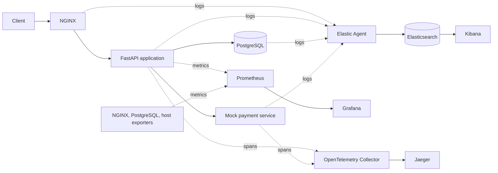

# ShopSphere Observability Lab

A hands-on learning project for understanding how logs, metrics, and distributed
traces help explain the behavior of an e-commerce application.

**Current milestone: Phase 6 — centralized logs are searchable in Kibana.**
Start the application and Elastic stack with `docker compose up`. The client
enters through NGINX on localhost:8088. Elastic Agent collects the application,
proxy, and database logs; Elasticsearch indexes them, and Kibana on localhost:5601
lets you follow requests across services. Metrics and tracing follow later.

The original project brief is preserved in
[docs/implementation-spec.md](docs/implementation-spec.md).

## 1. Project Motivation

An alert saying “checkout is slow” does not explain why. This lab will build a
small system where you can find the slowdown in a metric, examine related logs,
and follow the request through a trace to the database or payment service.

We will implement one phase at a time. Each phase will explain its concepts,
introduce files, verify the result, update the guide and learning journal, and
make a focused Git commit.

| Phase | Deliverable | Status |
| --- | --- | --- |
| 1 | Repository structure and learning documentation | Complete |
| 2 | FastAPI e-commerce service and application logging | Complete |
| 3 | PostgreSQL persistence and slow-query exercises | Complete |
| 4 | NGINX reverse proxy and request logging | Complete |
| 5 | Docker images and a runnable Docker Compose application | Complete |
| 6 | Centralized logs with Elastic Agent, Elasticsearch, and Kibana | Complete |
| 7 | Prometheus metrics, exporters, and Grafana dashboards | Planned |
| 8 | OpenTelemetry instrumentation, Collector, and Jaeger | Planned |
| 9 | Correlation exercises across logs, metrics, and traces | Planned |

## 2. Observability Concepts

| Signal | What it records | Question it helps answer |
| --- | --- | --- |
| Logs | Individual events with timestamps and context | What happened during this request? |
| Metrics | Numeric measurements over time | Are requests getting slower or failing more often? |
| Traces | Related timed operations, called spans, within a request | Which operation consumed the time? |

These signals complement each other. A latency metric can reveal a trend; a
trace can locate a slow database call; a log can explain an error from that call.
Later phases will attach trace IDs to application logs to connect the evidence.

Start with the [repository foundations](docs/learning-notes.md#phase-1-repository-foundations),
then follow the [Phase 2 lesson](docs/phase-02-fastapi.md) to learn HTTP routes,
request validation, process memory, and structured logging. The
[Phase 3 lesson](docs/phase-03-postgresql.md) explains how database transactions,
persistence, and slow-query evidence extend that foundation. The
[Phase 4 lesson](docs/phase-04-nginx.md) adds the proxy boundary, upstream timings,
access logs, and error logs. The [Phase 5 lesson](docs/phase-05-docker-compose.md)
explains images, containers, service discovery, volumes, and startup readiness.
The [Phase 6 lesson](docs/phase-06-centralized-logging.md) explains collection,
parsing, field mappings, data streams, retention, and cross-service searches.

## 3. Architecture Diagram

The diagram describes the **target system**. The request path through NGINX,
FastAPI, PostgreSQL, and mock payment is implemented, as is the centralized logging
path through Elastic Agent, Elasticsearch, and Kibana. Metrics and tracing remain
planned.



Solid request arrows show service calls; telemetry arrows show data movement.
Prometheus initiates scrapes even though metrics flow toward Prometheus.
Database-call spans will be generated by instrumentation in the application.
See [architecture.md](docs/architecture.md) for boundaries and design notes.

The current workspace is the repository root; no extra nested project directory
is needed. Each service directory contains a README explaining its role.

```text
METRICLOGTRACES/
├── .editorconfig
├── .gitattributes
├── .gitignore
├── .dockerignore            # Allow only image build inputs
├── docker-compose.yml      # Application and logging stack, networks, volumes
├── README.md
├── requirements.in          # Direct runtime dependencies
├── requirements.txt         # Pinned runtime dependency set
├── requirements-dev.in      # Direct development dependencies
├── requirements-dev.txt     # Pinned test and lint environment
├── pyproject.toml           # Test and lint settings
├── .python-version          # Python 3.12
├── .env.example             # Documented service connection settings
├── app/                     # FastAPI application
├── payment/                 # Separate mock service for distributed calls
├── nginx/                   # Reverse proxy configuration
├── postgres/                # Database initialization and logging configuration
├── elastic/                 # Elastic Agent log collection configuration
├── elasticsearch/           # Log storage configuration and notes
├── kibana/                  # Log exploration configuration and notes
├── prometheus/              # Scrape configuration
├── grafana/
│   ├── README.md
│   └── dashboards/          # Versioned dashboard definitions
├── otel/                    # OpenTelemetry Collector configuration
├── jaeger/                  # Trace storage and exploration configuration
├── tests/                   # API/proxy tests and isolated application/logging checks
└── docs/
    ├── architecture.md
    ├── implementation-spec.md
    ├── learning-journal.md
    ├── learning-notes.md
    ├── phase-02-fastapi.md
    ├── phase-03-postgresql.md
    ├── phase-04-nginx.md
    ├── phase-05-docker-compose.md
    ├── phase-06-centralized-logging.md
    └── troubleshooting.md
```

The application now has routes, HTTP schemas, SQLAlchemy models and transactions,
connection configuration, and JSON logging. `app/Dockerfile` builds the Python
services; `nginx/Dockerfile` builds the proxy. `docker-compose.yml` connects them.
The earlier native workflow remains available through `postgres/compose.yml`,
`nginx/nginx.conf`, and `nginx/manage.sh` for the Phase 3–4 exercises.

## 4. Request Lifecycle

The request path is:

1. A client sends a request to NGINX.
2. NGINX forwards it to FastAPI.
3. FastAPI validates the request and performs database operations.
4. When payment is needed, FastAPI calls the mock payment service over HTTP.
5. The response returns through NGINX to the client.

`POST /orders` validates and saves an order and its item rows in one
PostgreSQL transaction. It returns 201 only after the commit succeeds. It does
not charge or call payment. `GET /payment` separately demonstrates the HTTP call to
the mock service. Both services log their requests, and the API forwards
`X-Request-ID` to the payment service. NGINX validates or generates the initial ID,
forwards it to the API, and returns it to the client even for proxy-generated
errors. This is log correlation, not tracing yet.

## 5. Logging Pipeline

**Implemented in Phase 6:** application, NGINX, and PostgreSQL logs → Elastic Agent
→ Elasticsearch → Kibana.

Containerized NGINX writes JSON access events to stdout and native text errors
to stderr; inspect them with `docker compose logs nginx`. Access events include
request ID, client-visible status, upstream status, and proxy/upstream timings.
The connection number helps match a native error line to an access event.
Docker log files rotate at 10 MB with three files per container. Native Phase 4
runs still write to ignored `nginx/runtime/access.jsonl` and `error.log`.

The two applications emit structured JSON logs to stdout. Request events
include a UTC timestamp, service, request ID, route template, status, and duration.
Business events describe order creation and simulated payment approval. Error
events record failures. SQLAlchemy also emits query duration and failure events
with the current request ID. `trace_id` is currently null.

PostgreSQL writes connection, slow-statement, and error events to JSON files in
its data volume. Statements taking at least 250 ms are logged. Validated request
IDs are attached to application SQL as comments, connecting database logs with
the API logs. See the Phase 3 lesson for log inspection commands.

Elastic Agent reads Docker JSON files through a read-only mount and publishes only
this Compose project's API, payment, initializer, and NGINX records. A separate
read-only volume subpath supplies native PostgreSQL JSON. No Docker socket is
mounted. This collection scope excludes the earlier native Phase 3–4 services.

Elasticsearch normalizes timestamps, severity, service names, request IDs, and
durations. `event.duration` is in nanoseconds across sources. Raw events remain in
`event.original`; parsing failures receive `tags: parse_error`. The two data streams
match `logs-shopsphere.*-lab`, exposed by the **ShopSphere logs** Kibana data view.
Agent offsets, indexed logs, and database files have separate persistence needs.
See the [lesson](docs/phase-06-centralized-logging.md) for retention and outage limits.

## 6. Metrics Pipeline

**Planned in Phase 7:** application `/metrics` and infrastructure exporters →
Prometheus → Grafana.

Prometheus will periodically request, or scrape, metric endpoints. Exporters
translate measurements from systems such as PostgreSQL into a format Prometheus
understands. Grafana will query those stored time series to display request
rates, latency, errors, database activity, and host resource usage.

The application metric families will include `http_requests_total`,
`http_request_duration_seconds`, `database_query_duration_seconds`, and
`application_errors_total`.

## 7. Tracing Pipeline

**Planned in Phase 8:** OpenTelemetry SDKs in the application and payment service
→ OpenTelemetry Collector → Jaeger.

A span represents one operation. Related spans form a trace. Trace context
passed in HTTP headers connects the application request to the payment request.
Database client instrumentation records SQL operations as spans in the same
trace. The Collector receives and forwards spans; Jaeger lets us inspect them.

A parent request waiting for a five-second database call must last at least as
long as that call. If application work adds about 500 ms, the total is about
5.5 seconds for sequential work, not 500 ms. The original brief's timing example
is now implemented with the database wait included in the request duration.

## 8. Installation

For the Compose application, install Git and Docker Engine/Desktop with the
Compose v2 plugin and Linux containers. Verify `docker version` and
`docker compose version`. This milestone was tested with Engine 28.3.0 and
Compose 2.38.1. Run the commands below from the repository root in Bash/WSL.

The images pin Python 3.12.15, NGINX 1.30.5, PostgreSQL 18.6, and Elastic Stack 9.5.4
by version and digest. Allocate roughly 6 GiB or more to Docker for the combined
lab and several GiB for images. Volume-subpath support is required. The first
build requires network access to download images and Python
packages. No host Python environment or NGINX installation is needed to run
the Compose application.

For Python development and the native API/proxy tests, also install Python 3.12
and NGINX in the same Linux/WSL environment, then create a virtual environment:

```bash
python3.12 -m venv .venv
.venv/bin/python -m pip install -r requirements-dev.txt
```

If using `uv`, the equivalent is:

```bash
uv venv --python /usr/bin/python3.12 .venv
uv pip sync --python .venv/bin/python requirements-dev.txt
```

The development requirements include the runtime packages, pytest, and Ruff.
For only running the services, install `requirements.txt` instead. The `.in`
files declare direct dependencies; the `.txt` files pin the resolved versions.

For an existing environment, rerun dependency installation after dependency
changes. Native proxy tests were verified with Ubuntu's NGINX 1.24.0 package;
they use temporary unprivileged ports and need no sudo.

## 9. Running the System

Prepare the external Docker log volume once, then start the complete system.
The helper supports native Linux and Docker Desktop/WSL:

```bash
bash elastic/prepare-docker-logs.sh
docker compose up
```

The helper is safe to rerun. Its volume definition survives restarts and is
mounted read-only by Agent. See [collection setup](elastic/README.md) for details,
custom names/paths, and the Docker Desktop Windows CLI used from WSL.

Or build explicitly and wait for healthy services in the background:

```bash
docker compose up --build -d --wait --wait-timeout 360
docker compose ps --all
curl -i http://127.0.0.1:8088/products
```

Open [the API documentation](http://127.0.0.1:8088/docs) and
[Kibana Discover](http://127.0.0.1:5601/app/discover). NGINX, Elasticsearch (9200),
and Kibana (5601) publish loopback ports. Elasticsearch and Kibana have no TLS or
authentication in this local lab. The API uses `postgres:5432` and `payment:8001`;
NGINX forwards to `api:8000` and refreshes DNS after container replacement.

Startup waits for PostgreSQL health, successful `db-init`, and payment health
before starting the API, then waits for API health before starting NGINX.
`db-init` exiting with code 0 is expected. It creates missing tables and seeds
the catalogue without erasing orders; it is not a schema migration tool.
`/proxy-health` checks NGINX alone, while the API's health check uses `/products`
to include database access. Health checks also generate ordinary request logs.
Separately, `elastic-setup` installs the ingest pipeline, mappings, lifecycle
policy, streams, and data view after Elasticsearch/Kibana become healthy. Its
successful exit permits Agent startup. Application startup does not depend on
the logging backend.

The default project is `shopsphere`, with data volume `shopsphere_postgres_data`.
It is separate from the earlier `shopsphere-phase3` project and its orders.
The earlier volume remains available through the native workflow. Stop a native
Phase 4 proxy with `bash nginx/manage.sh stop` before using the same host port,
or choose another port with `SHOPSPHERE_PORT=8089 docker compose up -d --wait`.

`.env.example` documents optional Compose interpolation variables and native
Python settings. Compose reads `.env` automatically; native Python requires
explicitly exported variables. Container service URLs are set in Compose so
native localhost URLs cannot accidentally point containers at themselves.

```bash
docker compose logs --tail 50 api payment nginx
docker compose stop
docker compose up -d --wait
docker compose down
```

`stop` keeps containers and data. `down` removes this project's containers and
networks but retains database, Elasticsearch, and Agent state volumes. Adding
`--volumes` deletes their data and collection progress.
The external `shopsphere_docker_logs` volume is only a read-only view of Docker's
source directory and is not removed by Compose.
After source changes, run `docker compose up --build -d --wait`; restarting a
container alone does not copy updated source into its image.

For the host-process workflow from earlier phases, follow the
[native startup commands](docs/phase-04-nginx.md#run-the-local-proxy).

## 10. Testing Telemetry

Generate events for centralized search:

```bash
curl -H 'X-Request-ID: phase6-payment' http://127.0.0.1:8088/payment
curl -H 'X-Request-ID: phase6-slow' http://127.0.0.1:8088/slow-query
curl -H 'X-Request-ID: phase6-error' http://127.0.0.1:8088/error
```

In Kibana Discover choose **ShopSphere logs**, set **Last 15 minutes**, and search
`request_id: "phase6-payment"`. Expect API, payment, and NGINX records. The slow
request instead includes PostgreSQL evidence. Add `service.name`, `event.action`,
`log.level`, `event.duration`, and `message` as columns.

Run `python3 tests/logging_smoke.py` for isolated end-to-end log checks, including
parser failures, filtering, registry persistence, and backend outage recovery.
It starts a separate Elastic stack with temporary ports, requiring additional
memory; see the [Phase 6 lesson](docs/phase-06-centralized-logging.md).

The Compose lifecycle check uses only host Python 3 and Docker. It creates a
unique project, assigns a temporary host port, builds images, and removes only
its own containers and volume afterward. It starts only application services:

```bash
python3 tests/compose_smoke.py
```

It verifies initialization failure handling, readiness, order/payment requests,
correlated logs, dependency outages, API replacement at a different IP, and
order persistence across `down`/`up`. Use `--no-build` when the images are current.

Run the native regression checks with the development environment, Docker, and
the local NGINX binary available:

```bash
.venv/bin/python -m pytest -q
.venv/bin/python -m ruff check app payment tests
.venv/bin/python -m ruff format --check app payment tests
bash nginx/manage.sh test
```

Tests check order behavior, invalid inputs, JSON logs, concurrent request context,
cross-service request IDs, payment failures, persistence, rollback, database
constraints, and slow-query logs. The suite starts and removes its own PostgreSQL
container and creates a fresh database per test. It does not use or erase the lab
database. Proxy tests run separate NGINX and Uvicorn processes on temporary local
ports and verify forwarding, error responses, request IDs, timeouts, and reloads.
They stop only the processes they created. Existing lab servers need not be running.

| Request | Current behavior |
| --- | --- |
| `GET /` | Service status and current storage mode |
| `GET /proxy-health` | NGINX-only status; available through port 8088 |
| `GET /products` | Seeded products read from PostgreSQL, priced in USD cents |
| `POST /orders` | Validate items, calculate prices, store order; return 201 |
| `GET /orders/{id}` | Retrieve an order, or return 404 if missing |
| `GET /slow-query` | Real PostgreSQL delay; default 5 seconds, configurable from 0 to 5 |
| `GET /error` | Intentional 500, error log, and request log |
| `GET /payment` | HTTP simulation; 200 on success, 502/504 on dependency failures |
| `GET /metrics` | Planned for Phase 7; currently absent |

Follow the [Phase 5 walkthrough](docs/phase-05-docker-compose.md) to inspect
container lifecycle, logs, and persistence. Uvicorn's own startup messages
remain console text; application events are JSON, one per line.

## 11. Debugging Scenarios

Call `/error` through port 8088 and find its matching error and completion events
with `docker compose logs api nginx`. Then use `docker compose stop payment` and
call `/payment`; expect an API 502 or 504 and a dependency failure event. Restore
it with `docker compose start payment`.

Use port 8088 for these requests to include the proxy's access event. Stop only
the API with `docker compose stop api` and request `/products`: expect a proxy
502/504, a response request ID, and an upstream error in `docker compose logs nginx`.
Use `docker compose start api` to restore the path. An application 500 normally
passes through unchanged and does not itself create a NGINX error-log entry.

Try `GET /slow-query` with `X-Request-ID: phase3-slow`, then find that ID in the
API's SQL event and PostgreSQL's slow-statement log, read with
`docker compose exec -T postgres sh -c 'cat "$PGDATA"/log/*.json'`.
For a slow checkout, use `POST /orders?db_delay_seconds=5` with a normal order body. The default order path
has no artificial delay. Both delay parameters reject values outside 0–5 seconds.

The final exercise will be “checkout became slow.” We will use this controlled
database delay, find the latency increase in Grafana, locate related events in
Kibana, and inspect the database span in Jaeger. After removing the delay, we will
repeat the request and confirm the improvement in all three signals.

Removing `db_delay_seconds` removes the injected wait; compare the SQL and request
durations. This is an intentional delay exercise, not a query-index optimization.

## 12. Common Problems

See [troubleshooting.md](docs/troubleshooting.md) for environment, import, payment,
port, database readiness, persistence, proxy errors, and log-location problems.

## 13. Production Improvements

This repository will teach production concepts through a local lab. Future
production discussions will cover authentication, TLS, secret management,
telemetry retention, trace sampling, backups, availability, and alerting.
Authentication, TLS, backups, and high availability are not implemented. The lab
has an Elasticsearch rollover/deletion policy but no automatic age-based cleanup
of PostgreSQL source logs. The current lab also uses a local
database owner account and an explicit table-creation command. Production needs
separate migration/runtime roles, managed secrets, schema migrations, and a
backup/recovery plan; a persistent Docker volume alone is not a backup.

## 14. Kubernetes Migration Path

After completing and understanding the Compose lab, we will map service
containers to Kubernetes workloads, networking to Services, and persistent data
to volumes. Then we will discuss Helm packaging, the Prometheus Operator,
Elastic's Kubernetes integration, and a production Jaeger deployment.

Kubernetes is a later learning extension. The next implementation milestone is
**Phase 7: metrics monitoring with Prometheus, exporters, and Grafana**.
