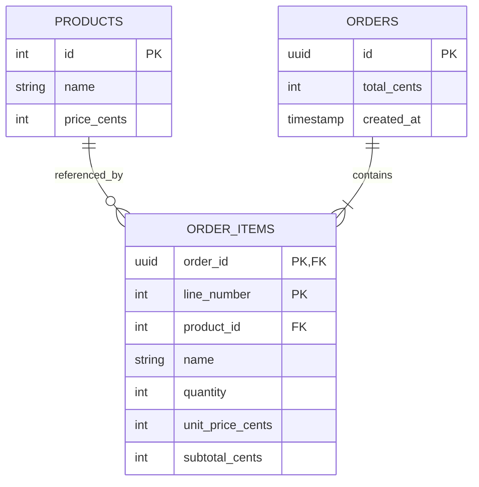

# Phase 3: PostgreSQL persistence and slow-query evidence

Orders now survive application restarts and are shared by API instances. This
phase replaces the Phase 2 memory store with SQLAlchemy and PostgreSQL while
keeping the product/order HTTP contract. Prices remain integer USD cents.

## What changed and why

| Component | Job | Production equivalent |
| --- | --- | --- |
| PostgreSQL | Persist data and enforce relational constraints | A managed or operated database service |
| SQLAlchemy models | Map Python objects to tables and relationships | Versioned application persistence models |
| Psycopg | Exchange PostgreSQL protocol messages with the database | The application's database driver |
| SQLAlchemy engine | Manage a reusable pool of connections | Bounded database connection usage per process |
| Session and transaction | Read/write one operation's data together | An atomic unit of business work |
| Named Docker volume | Preserve database files independently of a container | Persistent storage, with separate backup requirements |

Docker is used here only to provide the database. The API and payment service
remain local Python processes; full containerization is Phase 5 work.

## Understand the data model



The product row holds today's catalogue information. The order item snapshots
the name and unit price at purchase time, so a later catalogue edit cannot change
the recorded order. Each line has its own number; repeated products are allowed
as separate lines, matching Phase 2 behavior.

Foreign keys connect items to their order and product. Check constraints reject
invalid quantities, nonpositive prices, and incorrect item subtotals even when
SQL is issued outside the API. The application calculates the overall order total.

## Connections, sessions, and transactions

The API creates one engine at startup. It retains up to five pooled connections
and permits five additional overflow connections. `pool_pre_ping` checks a
connection before reuse. A session is opened for each store operation and is
never shared between concurrent requests.

For an order, the transaction reads the requested products, constructs the order
and item snapshots, and flushes the inserts. Flushing sends SQL; committing makes
the transaction durable. The transaction commits before `order.created` is
logged and before HTTP 201 is returned. If an item insert fails, the transaction
rolls back the preceding order insert as well.

The `with sessions.begin()` block handles commit/rollback and closes the session.
The engine closes its pooled connections at application shutdown. See
[SQLAlchemy session basics](https://docs.sqlalchemy.org/en/20/orm/session_basics.html)
for transaction boundaries and session lifetime.

Database routes use synchronous `def` functions. FastAPI runs them in its worker
thread pool, so waiting on Psycopg does not occupy the async event loop. The
payment route continues to use async HTTP. See
[FastAPI's concurrency explanation](https://fastapi.tiangolo.com/async/#path-operation-functions).

## Start and initialize PostgreSQL

Update the Python environment using the [README](../README.md#8-installation),
then run these commands from the repository root:

```bash
docker compose -f postgres/compose.yml up -d --wait
.venv/bin/python -m app.database
```

The official image creates the database and local lab role on an empty data
volume. The Python initialization command creates missing tables from
`app/models.py`, then executes `postgres/init.sql` to insert the three sample
products. `ON CONFLICT DO NOTHING` preserves existing catalogue rows.

Run initialization before starting API workers. Repeating it preserves existing
data; it is not a schema migration system and will not alter existing columns.
Future schema evolution should use reviewed migrations, such as Alembic.

PostgreSQL 18's image stores versioned database files beneath
`/var/lib/postgresql`; the Compose volume mounts that parent directory. See the
[official image documentation](https://hub.docker.com/_/postgres) for initialization
and storage behavior. The application connects to the published localhost port
using `DATABASE_URL`. The defaults in `.env.example` match this lab container.

Now start both Python services with the [README commands](../README.md#9-running-the-system).
The API checks the database at startup and gives an initialization hint if it is
unavailable. `GET /` is process status; database-dependent routes return 503 if
database operations fail after startup.

## Prove persistence

Create an order:

```bash
curl -i http://127.0.0.1:8000/orders \
  -H 'Content-Type: application/json' \
  -H 'X-Request-ID: phase3-order' \
  -d '{"items":[{"product_id":1,"quantity":2}]}'
```

Expect 201 and `total_cents: 4998`. Save its UUID from the response. Stop the API
with Ctrl+C, restart it, then request `/orders/<saved-uuid>`. Expect the same order.

Restart the database and repeat the lookup:

```bash
docker compose -f postgres/compose.yml restart postgres
docker compose -f postgres/compose.yml up -d --wait
```

The order remains because its files live in a named volume. You can inspect the
tables directly without installing psql on your host:

```bash
docker compose -f postgres/compose.yml exec postgres \
  psql -U shopsphere -d shopsphere -c 'SELECT id, total_cents, created_at FROM orders;'
```

`docker compose -f postgres/compose.yml down` retains the volume. Adding
`--volumes` would erase it. Persistence does not replace backups or recovery tests.

## Generate a real slow query

```bash
curl -i -H 'X-Request-ID: phase3-slow' http://127.0.0.1:8000/slow-query
```

The route runs a parameterized `SELECT pg_sleep(:seconds)` in PostgreSQL. Its
default wait is five seconds. The response reports the requested delay and the
observed execution duration; scheduling can make the observed time slightly
longer. `?seconds=0.3` gives a shorter exercise. Values must be finite and between
zero and five. See [PostgreSQL delay functions](https://www.postgresql.org/docs/18/functions-datetime.html#FUNCTIONS-DATETIME-DELAY).

The API emits a `database.query` event with `query_name: "lab.slow_query"`,
`db_operation: "SELECT"`, the backend PID, duration, and request ID. Queries lasting
at least 250 ms have warning severity. A request completion event contains the
same ID and the overall request duration.

The SQL event measures the driver execution, while the request timer includes
pool acquisition, application work, and response handling. Neither is a trace
span yet. Connections have a ten-second statement timeout as an upper bound for
each SQL statement, including statements outside this bounded delay exercise.

## Inspect native PostgreSQL logs

```bash
docker compose -f postgres/compose.yml exec -T postgres \
  sh -c 'cat "$PGDATA"/log/*.json' | rg 'phase3-slow'
```

The native JSON event contains the slow SQL and a `request_id=phase3-slow` comment.
Middleware accepts only bounded alphanumeric IDs plus hyphens/underscores before
they can enter that comment. Query values remain bound parameters.

SQLAlchemy logs metadata without bind values. PostgreSQL's configuration disables
bind-parameter logging, records statements taking at least 250 ms, and enables
connection, disconnection, and error logs. The collector writes these files under
`$PGDATA/log/`; after startup they are not normally shown by `docker compose logs`.
See [PostgreSQL logging configuration](https://www.postgresql.org/docs/18/runtime-config-logging.html).

These SQL comments are a lab correlation technique. They change statement text
per request and can affect statement-cache reuse. Production correlation can use
tracing, backend/session identifiers, and suitable database instrumentation.

## Debug a slow checkout and remove the injected cause

```bash
curl -sS -w '\nTotal seconds: %{time_total}\n' \
  'http://127.0.0.1:8000/orders?db_delay_seconds=5' \
  -H 'Content-Type: application/json' \
  -H 'X-Request-ID: phase3-checkout-slow' \
  -d '{"items":[{"product_id":1,"quantity":1}]}'
```

This delays the database transaction before inserting the order. Find the request
ID in the application's slow SQL event, order event, request event, and native
PostgreSQL log. The delay is optional and defaults to zero.

Repeat without `?db_delay_seconds=5`, using `X-Request-ID: phase3-checkout-normal`.
Expect another order without the five-second wait. Compare the request timings.
This removes an injected cause; it does not demonstrate query-plan tuning. Metrics
and traces will add other views of the same exercise in later phases.

## Inspect errors and rollback

To generate a database-only error for observation:

```bash
docker compose -f postgres/compose.yml exec postgres \
  psql -U shopsphere -d shopsphere -c 'SELECT 1 / 0;'
```

This command intentionally exits with an error and produces a native PostgreSQL
event with SQLSTATE `22012` (division by zero). It is a psql request, so it has no
API request ID. `/error` remains the separate application-exception exercise.

To observe dependency failure, stop only the lab database, request `/products`,
and expect 503 plus a correlated database failure event. Start PostgreSQL again
with `up -d --wait`; the API should recover on a subsequent database request.

The automated rollback test temporarily adds a rejecting item constraint in its
own private database, attempts an order, and verifies that neither an order nor
an item remains. A following valid order succeeds, proving that the failed
transaction did not leave an unusable session behind.

## Tests and production follow-through

Run `.venv/bin/python -m pytest -q` with Docker available. The suite starts a
temporary PostgreSQL container with the same logging configuration, creates a
fresh database per test, and removes its own resources afterward. It never uses
the regular lab database. Failure to start PostgreSQL fails the tests.

Production would separate migration and runtime database privileges, use managed
secrets, review schema migrations, size connection pools across all API workers,
and establish backup and log-retention policies. The local named volume and owner
account make the mechanics visible but do not implement those operating controls.

## Learner checkpoint

1. Explain the difference between an engine, a connection, a session, and a transaction.
2. Show an order before and after restarting the API.
3. Explain why a failed item insert must undo its order insert.
4. Explain why an old order keeps its price after the catalogue changes.
5. Connect one slow API request to a native PostgreSQL log using its request ID.
6. Remove the checkout delay and explain which measurements changed.

Next is Phase 4: place NGINX in front of the API and study reverse proxy access
logs, error logs, and the request path through the proxy.
