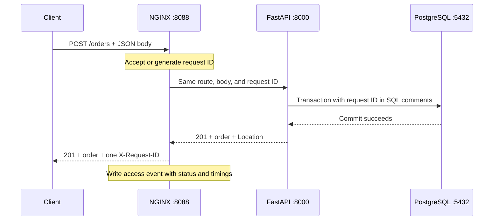

# Phase 4: NGINX and the proxy boundary

This phase puts a reverse proxy in front of the working application. It gives
clients one entry point and records requests even when the API is unavailable.
The new files are `nginx/nginx.conf`, `nginx/manage.sh`, and
`tests/test_nginx.py`. The API's business behavior and PostgreSQL storage carry
forward from [Phase 3](phase-03-postgresql.md).

## Why a reverse proxy exists

A reverse proxy accepts a client's HTTP connection, makes a separate connection
to an application server, and sends the application's response back to the
client. NGINX calls that application server its **upstream**. The client sees
NGINX's address; the application can run at a different address or port.

This boundary is useful for routing, connection management, and access logging.
In production it may also terminate TLS and balance traffic across API replicas.
Here it forwards to one API process so that each hop remains easy to inspect.



NGINX does not calculate prices or save orders. FastAPI owns those operations.
`GET /payment` takes another path from the API to the mock payment service and
propagates the same request ID. Order creation does not call payment.

## Run the local proxy

Follow the [startup guide](../README.md#9-running-the-system) to start PostgreSQL,
initialize the tables, and run payment on port 8001 and the API on port 8000.
NGINX and Python must run in the same Linux/WSL environment. Check the installed
binary with `nginx -v`; this milestone was verified with NGINX 1.24.0.

Then run from the repository root:

```bash
bash nginx/manage.sh test
bash nginx/manage.sh start
curl -i http://127.0.0.1:8088/proxy-health
curl -i -H 'X-Request-ID: phase4-products' http://127.0.0.1:8088/products
```

Both requests should return 200. The first is answered by NGINX without contacting
the API. The second must travel through the API to PostgreSQL. Open
[the API docs through NGINX](http://127.0.0.1:8088/docs) to exercise the routes.

The lab listens only on loopback at the unprivileged port 8088. The helper sets
`nginx/` as the configuration prefix and stores its PID, logs, and temporary
files under `nginx/runtime/`. These generated files are ignored by Git. No sudo
is needed, and the helper addresses this lab's instance rather than a system
service. `NGINX_BIN` can override the executable path.

NGINX's master process reads configuration and manages workers. A worker handles
HTTP connections using an event loop; one worker is enough for this lab. The
upstream keepalive pool permits connection reuse to the API. It is separate from
the API's SQLAlchemy pool of database connections.

## Read the forwarding configuration

`upstream shopsphere_api` names the API at `127.0.0.1:8000`. The `/` location uses
`proxy_pass http://shopsphere_api` with no URI suffix, preserving the request's
route and query parameters. The JSON body and API response pass through as well.
The special `/proxy-health` location returns a response locally.

The `Host` header retains the client-facing port, so a redirect such as
`/products/` → `/products` still points to port 8088. NGINX replaces incoming
forwarding headers with the observed client address and scheme for this hop.
Uvicorn starts with `--proxy-headers --forwarded-allow-ips 127.0.0.1` to trust
forwarding headers from loopback. That trusts other local processes too; this is
a single-host lab boundary, not authentication. A production proxy chain needs
an explicit list of trusted proxies and appropriate network restrictions.

The body limit is 1 MiB. The upstream connect timeout is two seconds, and the
send/read timeouts are 30 seconds. A read timeout measures the interval between
upstream reads, not a total deadline for a streaming response. The five-second
SQL exercise fits within it. Automatic upstream retries are disabled so NGINX
does not retry a failed checkout. This is separate from application-level
idempotency, which the lab does not implement.

See the official [proxy module reference](https://nginx.org/en/docs/http/ngx_http_proxy_module.html)
for forwarding and timeout behavior, and the
[upstream reference](https://nginx.org/en/docs/http/ngx_http_upstream_module.html)
for connection reuse and upstream timing variables.

## Follow one request ID

A valid incoming `X-Request-ID` contains 1–64 ASCII letters, digits, hyphens, or
underscores. NGINX preserves it. An absent or invalid value becomes a new
32-character hexadecimal ID. This matches the API's validation policy.

The proxy forwards that ID to the API, records it in its access event, and sends
one `X-Request-ID` response header. It hides the API's duplicate response header
and uses `add_header ... always` so proxy-generated errors also have an ID.

```bash
curl -i -H 'X-Request-ID: phase4-payment' http://127.0.0.1:8088/payment
rg 'phase4-payment' nginx/runtime/access.jsonl
```

Find the same ID in the API and payment terminal logs. Repeat without the header
and copy the generated response ID to search for that request. These IDs connect
log events; they are not trace IDs, and application `trace_id` remains null until
Phase 8. IDs supplied by clients can repeat and are not proof of identity.

The implementation uses NGINX's [map module](https://nginx.org/en/docs/http/ngx_http_map_module.html),
the built-in [$request_id variable](https://nginx.org/en/docs/http/ngx_http_core_module.html#var_request_id),
and the [response header module](https://nginx.org/en/docs/http/ngx_http_headers_module.html).

## Understand access logs and timing

Each completed HTTP request produces one JSON line in
`nginx/runtime/access.jsonl`. `escape=json` escapes variable contents, so a quote
in a URL does not break the JSON. The configured path field uses `$uri`, without
query parameters; request bodies and authorization headers are not logged here.

| Field | Meaning |
| --- | --- |
| `time`, `service`, `event` | ISO timestamp with offset, `nginx`, and `proxy.request` |
| `request_id` | ID shared with the API and its downstream calls |
| `method`, `path` | HTTP method and normalized path without the query string |
| `status_code` | Final HTTP status sent to the client |
| `bytes_sent` | Response body bytes sent, excluding headers |
| `request_duration_seconds` | Time from the first client request bytes until request logging |
| `upstream_address`, `upstream_status` | Upstream peer and status information |
| `upstream_connect_seconds` | Time to establish the upstream connection |
| `upstream_header_seconds` | Time until the upstream response headers arrive |
| `upstream_response_seconds` | Time receiving the upstream response, including its wait |
| `connection`, `connection_requests` | Connection number and requests served on it |

Upstream values are JSON strings because some requests never reach an upstream.
Absent values may be empty or `-`; `/proxy-health` produces an empty upstream
status with the tested package. Do not treat an absent measurement as zero.
`request_duration_seconds`, status, and byte count are JSON numbers.

NGINX timings use **seconds**, while application and SQL `duration_ms` values use
**milliseconds**. The timers cover different boundaries. A proxy duration also
includes client transfer and forwarding overhead; an API SQL event covers a
database operation. Compare magnitudes after converting units, without treating
their difference as an exact measurement of network latency.

For the precise log variable definitions, see the
[access log module reference](https://nginx.org/en/docs/http/ngx_http_log_module.html).

## Connect a slow request across three layers

```bash
curl -sS -w '\nTotal seconds: %{time_total}\n' \
  -H 'X-Request-ID: phase4-slow' http://127.0.0.1:8088/slow-query
rg 'phase4-slow' nginx/runtime/access.jsonl
docker compose -f postgres/compose.yml exec -T postgres \
  sh -c 'cat "$PGDATA"/log/*.json' | rg 'phase4-slow'
```

Expect a 200 response after roughly five seconds. The NGINX access event's
upstream and overall durations should include that wait. Find the same ID in the
API's SQL and request events and in PostgreSQL's native slow-statement log.

Now try a delayed checkout:

```bash
curl -i 'http://127.0.0.1:8088/orders?db_delay_seconds=5' \
  -H 'Content-Type: application/json' \
  -H 'X-Request-ID: phase4-checkout-slow' \
  -d '{"items":[{"product_id":1,"quantity":1}]}'
```

Expect 201 with a `Location` header. Retrieve that path through port 8088. Repeat
the POST without the delay parameter and use `phase4-checkout-normal` as its ID.
This creates another order; compare the two access durations. The proxy records
the slowdown but the SQL events explain where the time went.

## Distinguish application errors from proxy errors

```bash
curl -i -H 'X-Request-ID: phase4-error' http://127.0.0.1:8088/error
rg 'phase4-error' nginx/runtime/access.jsonl
```

Expect the API's JSON 500 response, its request ID, and a proxy access event with
status 500. `proxy_intercept_errors off` leaves application errors intact. A
valid upstream HTTP 500 does not by itself create a native NGINX error line;
find the exception in the API log.

Next stop only the API using Ctrl+C in its terminal, keeping NGINX running:

```bash
curl -i -H 'X-Request-ID: phase4-api-down' http://127.0.0.1:8088/products
curl -i http://127.0.0.1:8088/proxy-health
rg 'phase4-api-down' nginx/runtime/access.jsonl
tail -n 10 nginx/runtime/error.log
```

The product request now returns a proxy-generated HTML 502 with a request ID.
The health route still returns 200. There is no corresponding API event because
the request could not reach it. Restart the API with the root guide's command
and confirm `/products` returns 200 again.

The native error log is **text**, recording connection, timeout, and other NGINX
problems. Its `*number` identifies the connection and can be matched with an
access event's `connection`, path, and timestamp. A keepalive connection can
carry several requests, so the connection number alone is not a unique request
key. Native error lines may include the full request URI and query parameters,
even though the JSON access log excludes query parameters.

| Trigger | Expected evidence |
| --- | --- |
| API `/error` | JSON 500, proxy access event, API exception |
| Payment process stopped | API JSON 502, proxy access event, API payment failure |
| API process stopped | NGINX HTML 502, proxy access event, native connection error |
| No upstream data arrives before the read timeout | NGINX 504, access event, native timeout error |
| Body larger than 1 MiB | NGINX 413 before forwarding to the API |

An `upstream_status` of 502 alone does not identify which component failed.
Use the response and both layers' logs. The tests exercise proxy timeouts using
a private configuration with a 100 ms read timeout and a 300 ms SQL wait; the
checked-in configuration stays at 30 seconds.

## Validate, reload, and stop

```bash
bash nginx/manage.sh test
bash nginx/manage.sh reload
bash nginx/manage.sh stop
```

`test` checks configuration syntax and referenced files. `reload` tests before
sending the reload signal. NGINX starts workers with the new configuration while
older workers finish existing connections. An invalid configuration is rejected
by the helper before signalling, leaving the current worker configuration active.

`stop` sends a graceful quit using the lab's own PID file. The configured worker
shutdown timeout bounds the time spent finishing connections to 35 seconds.
Use `foreground` instead of `start` if you need a process attached to a terminal.
See [NGINX command switches](https://nginx.org/en/docs/switches.html) and
[process control](https://nginx.org/en/docs/control.html) for the lifecycle.

## Verification and production follow-through

Run `.venv/bin/python -m pytest -q` with Docker and NGINX available. Integration
tests start real API, payment, and NGINX processes on private temporary ports and
use the suite's isolated PostgreSQL databases. They verify forwarding, JSON
escaping, request IDs, payment correlation, slow SQL, failure recovery, timeouts,
body limits, configuration rejection, reload, and graceful shutdown. The tests
clean up their own processes and database container.

Production commonly adds TLS, multiple application instances, controlled network
access, log rotation and retention, request limits, and deployment health checks.
Those are separate operating decisions. This lab currently has one local API,
no TLS, and logs retained in local files without rotation. Phase 5 moves the
services into a reproducible Compose application; Phase 6 collects and parses
both JSON access events and native text errors.

## Learner checkpoint

1. Explain why a request can appear in NGINX's log but never reach the API.
2. Show one request ID in the proxy, API, and payment logs.
3. Explain why a successful `/proxy-health` does not prove checkout works.
4. Convert a five-second proxy duration to the API's millisecond units.
5. Distinguish an API-generated 500 from an unavailable-upstream 502.
6. Restore API service after the outage exercise and verify recovery.
7. Explain how the helper targets this repository's NGINX instance.

Next is Phase 5: Docker images, containers, service discovery, networks, volumes,
and one Compose command for the application stack.
