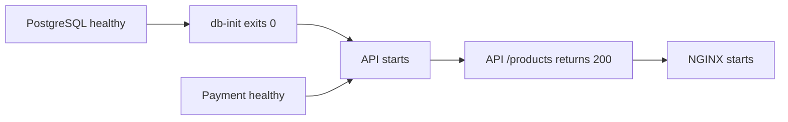

# Phase 5: Run the application with Docker Compose

The complete request path now runs in containers. One command builds missing
images, creates a network and database volume, initializes tables, and starts
NGINX, FastAPI, PostgreSQL, and mock payment. Logs remain at their sources;
central collection starts in Phase 6.

This lesson describes the Phase 5 milestone. The current Compose file also
includes Phase 6 logging and Phase 7 metrics services, with application tags `0.7.0`.
Use `docker compose up --build -d --wait nginx` to start only the application
dependencies for these exercises, or follow the
[Phase 6 startup guide](phase-06-centralized-logging.md) for the combined stack.

## What containers solve

The previous phases required local Python packages, a native NGINX installation,
and several terminals. An **image** packages a filesystem, runtime, dependencies,
and default command. A **container** runs a process from that image with its own
network and filesystem view. Containers share the Docker host's kernel; on
Docker Desktop, that is the Linux environment managed by Docker Desktop.

Compose describes how these processes connect and which state persists. The
same repository now provides both the application code and its runtime setup.
This makes startup reproducible and keeps environment differences visible in
configuration rather than scattered shell commands.

| File | Responsibility |
| --- | --- |
| `app/Dockerfile` | Build the Python runtime, pinned packages, source, and SQL seed |
| `nginx/Dockerfile` | Build the non-root NGINX image with its configuration |
| `nginx/container.conf` | Container listener, log streams, and Docker DNS |
| `nginx/includes/` | Forwarding and logging rules shared with native Phase 4 |
| `.dockerignore` | Limit the files sent to image builds |
| `docker-compose.yml` | Services, commands, environment, health, network, and volume |
| `.env.example` | Optional interpolation values and documented native settings |
| `tests/compose_smoke.py` | Verify a disposable stack and its lifecycle |

## Read the image build

`app/Dockerfile` starts with Python 3.12.15 on Debian Bookworm slim. It copies
`requirements.txt` and installs those packages before copying source. A code
edit can therefore reuse the dependency layer. The image includes both Python
services and `postgres/init.sql`, which the initializer reads from the image.
It does not need a host virtual environment at runtime.

Compose builds three tags from this one recipe: `shopsphere-api:0.5.0`,
`shopsphere-payment:0.5.0`, and `shopsphere-db-init:0.5.0`. They share cached
layers, while separate tags prevent parallel image-export collisions. Their
different runtime commands choose the API, payment, or database initializer.

The Python services run as UID 10001. NGINX runs as its image's `nginx` user on
unprivileged port 8088. Compose makes their root filesystems read-only and
provides `/tmp` as temporary memory-backed storage. PostgreSQL keeps the official
image's initialization behavior and writes its data to a named volume.

Base images specify both a readable version tag and a SHA-256 digest. The digest
selects a fixed image even if the publisher updates the tag. Updating a pin is a
reviewed change followed by rebuilding and testing; it does not automatically
receive newer fixes. See [Docker's image build guidance](https://docs.docker.com/build/building/best-practices/).

The verified bases are [Python 3.12.15](https://hub.docker.com/_/python),
[NGINX 1.30.5](https://hub.docker.com/_/nginx), and the existing PostgreSQL 18.6.
`.dockerignore` allows only required source, seed, and image configuration files.
Local credentials, Git history, runtime logs, tests, and `.venv` stay out of the
build context. Secrets are not build arguments or copied files.

## Start and inspect the stack

Use Docker Engine/Desktop with Linux containers and the Compose v2 plugin.
The first build needs network access for base images and Python packages.

```bash
docker version
docker compose version
docker compose config --quiet
docker compose up --build -d --wait
docker compose ps --all
curl -i http://127.0.0.1:8088/products
```

Expect four healthy services and `db-init` exited with code 0. Visit
[the API docs](http://127.0.0.1:8088/docs). Plain `docker compose up` also works;
it builds missing images and stays attached to logs. Ctrl+C stops that attached
stack. `-d` leaves containers running in the background, and `--wait` waits for
the configured health checks.

The default project name is `shopsphere`. The project groups its containers,
network, and volume. A different `--project-name` creates another set of those
resources and requires a different host port. Service commands such as
`docker compose exec api ...` find the right container without a fixed
`container_name`.

## Understand startup readiness



A running process may still be initializing. PostgreSQL's TCP health check
waits until it accepts connections. `db-init` then runs `python -m app.database`
to create missing tables and seed products. The API waits for that command to
succeed and for payment health. Finally NGINX waits for API health.

The initializer is intentionally a separate, inspectable step. It preserves
existing orders and does not restart endlessly on failure. Inspect a failure
with `docker compose logs db-init`; fix the cause and run `up` again. Creating
missing tables is not a replacement for versioned schema migrations.

API health reads `/products`, checking the database too. Payment health checks
its own `/` route. `/proxy-health` checks NGINX alone, so it can pass during an
API outage. Health probes generate ordinary application/access events.

Compose's dependency conditions gate startup. They are not ongoing supervision
of dependencies. An unhealthy flag does not itself restart a container;
`restart: unless-stopped` concerns process exit and daemon restart behavior.
See [Compose startup ordering](https://docs.docker.com/compose/how-tos/startup-order/).

## Understand names, networks, and ports

| Caller | Destination | Address |
| --- | --- | --- |
| Browser or curl on the host | NGINX | `127.0.0.1:8088` |
| NGINX container | API | `api:8000` |
| API and initializer | PostgreSQL | `postgres:5432` |
| API container | Payment | `payment:8001` |

Within a container, `127.0.0.1` refers to that container itself. It is appropriate
for a health probe checking its own process, but cannot locate another service.
Compose places these services on its `app` bridge network and supplies DNS names.
Only the proxy has a published host port. `EXPOSE` in an image documents ports;
it does not publish them. See [Compose networking](https://docs.docker.com/compose/how-tos/networking/).

Inspect name resolution and the proxy configuration:

```bash
docker compose exec api python -c "import socket; print(socket.gethostbyname('postgres'))"
docker compose exec nginx nginx -T
docker network inspect shopsphere_app
```

An API container can receive a different address when recreated. The container
NGINX uses Docker's resolver at `127.0.0.11`, refreshes results after five seconds,
and has an upstream shared-memory zone with `server api:8000 resolve`. This lets
it follow a new address without restarting. Existing requests can still fail
during replacement; this one-replica lab does not promise zero downtime.
See the [NGINX upstream resolver](https://nginx.org/en/docs/http/ngx_http_upstream_module.html#server).

NGINX replaces incoming forwarding headers. The API's container command uses
`--forwarded-allow-ips '*'`, trusting all peers on the lab network. It has no
published port, but other containers on the network share this trust. This is
not authentication or a production policy; a production deployment should limit
which network peers can reach the API and supply trusted forwarding headers.

## Understand environment variables

Compose injects `DATABASE_URL` with host `postgres` and `PAYMENT_BASE_URL` with
host `payment`. The Python code still accepts the same settings as before.
The default database credentials are explicitly local lab values.

`SHOPSPHERE_PORT` and `PAYMENT_TIMEOUT_SECONDS` are interpolated by Compose.
For example, if port 8088 is occupied:

```bash
SHOPSPHERE_PORT=8089 docker compose up -d --wait
```

For a persistent override, create a local `.env` using `.env.example` as a guide.
Shell variables override `.env` values. Compose reads `.env` for interpolation;
it does not pass every variable into every container. The native localhost URLs
in the example are not used by Compose, which explicitly sets service-name URLs.
Native Python does not load `.env` automatically. Inspect the resolved setup with
`docker compose config`; its output includes configured credentials. See
[Compose interpolation](https://docs.docker.com/compose/how-tos/environment-variables/variable-interpolation/).

## Create an order and prove persistence

```bash
curl -i http://127.0.0.1:8088/orders \
  -H 'Content-Type: application/json' \
  -H 'X-Request-ID: phase5-order' \
  -d '{"items":[{"product_id":1,"quantity":2}]}'
```

Save the returned `Location`, such as `/orders/<uuid>`. Retrieve it, then run:

```bash
docker compose restart api
docker compose up -d --wait
docker compose down
docker compose up -d --wait
```

Retrieve the saved path again and expect the same order. The API container holds
no durable order state; PostgreSQL stores it in `shopsphere_postgres_data`,
mounted at `/var/lib/postgresql`. Recreating the database container reuses that
volume. This illustrates [Docker volume lifetime](https://docs.docker.com/engine/storage/volumes/).

| Operation | Containers | Database data |
| --- | --- | --- |
| `stop` | Retained, stopped | Retained |
| `start` | Existing containers start | Retained |
| `restart` | Existing containers restart | Retained |
| `up --build -d --wait` | Build and reconcile the requested configuration | Retained |
| `down` | Removed along with the project network | Retained |
| `down --volumes` | Removed | Deleted for this project |

The older `postgres/compose.yml` belongs to project `shopsphere-phase3` and uses
`shopsphere-phase3_postgres_data`. Its earlier orders remain there. The root
project starts a separate database and does not copy or erase the older one.
Do not mount the same PostgreSQL data directory into two running database
servers. Moving orders between projects requires a deliberate database
export/restore, separate from starting the new stack.

Changing database initialization credentials does not rewrite a role in an
existing volume. Volume persistence also does not provide backups or recovery
testing by itself.

## Read logs across containers

```bash
curl -i -H 'X-Request-ID: phase5-payment' http://127.0.0.1:8088/payment
docker compose logs --no-color api payment nginx | rg 'phase5-payment'
curl -i -H 'X-Request-ID: phase5-slow' http://127.0.0.1:8088/slow-query
docker compose logs --no-color api nginx | rg 'phase5-slow'
docker compose exec -T postgres sh -c 'cat "$PGDATA"/log/*.json' | rg 'phase5-slow'
```

NGINX and application access events are JSON, one per line. NGINX native errors
and Uvicorn startup messages are text on stderr. Compose normally adds service
prefixes for readability; `--no-log-prefix` removes those prefixes, but mixed
stderr text still means the entire output is not a pure JSON file.

Docker captures stdout/stderr using its JSON-file driver, with a 10 MB limit
and three retained files per container. Its outer JSON record wraps the process
output; application JSON is the payload. These logs are local and are removed
with the container. See the [Docker JSON-file driver](https://docs.docker.com/engine/logging/drivers/json-file/).
PostgreSQL's collector still writes its native JSON into the database volume;
Docker log rotation does not control those files. Phase 6 will address collection
and retention across these different sources.

## Practice failure and recovery

Stop payment, call `/payment`, and inspect the API's `payment.failed` event:

```bash
docker compose stop payment
curl -i http://127.0.0.1:8088/payment
docker compose logs --tail 20 api
docker compose start payment
```

Expect API JSON 502 if the dependency connection fails promptly, or 504 if it
times out. Docker may disconnect a stopped peer, making a cached address time
out instead of immediately refusing a connection. Retry after startup to see
200 again. The HTTP client resolves the service name when reconnecting.

Stop PostgreSQL and request `/products`: expect 503 while the API's `/` remains
available. Start PostgreSQL again and retry; its checked connection pool recovers.
Then stop the API: product requests get NGINX HTML 502/504, while `/proxy-health`
still returns 200. `docker compose start api` restores the path. These failures
have different owners even when they share an HTTP status code.

To replace just the API container while leaving NGINX running:

```bash
docker compose up -d --no-deps --force-recreate --wait api
curl -i http://127.0.0.1:8088/products
```

Allow a brief DNS refresh interval if its address changed. The smoke test goes
further: it reserves the old address in its disposable network to force a change,
then proves NGINX recovered without being restarted.

## Rebuild, verify, and understand the limits

Source and proxy configuration are copied into images. After edits, run
`docker compose up --build -d --wait`. `restart` alone runs the existing image.
The database configuration is a read-only bind mount and requires a database
restart for startup-only settings. No Docker socket is mounted into a service.

Run the isolated lifecycle check with host Python 3 and Docker:

```bash
python3 tests/compose_smoke.py
```

It builds images, tests failed initialization and healthy startup, verifies
requests and logs, interrupts dependencies, changes the API's address, and
checks persistence after `down`/`up`. Its generated project name, temporary port,
and temporary network configuration isolate it from the regular lab. Cleanup
removes only that test project's containers and volume. `--no-build` uses
already-built images. The existing pytest suite separately covers API/database
behavior and the native NGINX configuration.

This is a single-host learning environment. Production work includes managed
secrets, schema migrations, backups, image update/scanning policies, access
control, TLS, resource sizing, and service redundancy. Compose demonstrates the
container mechanics without providing those operating practices automatically.

## Learner checkpoint

1. Explain why three Python services can use one Dockerfile but different commands.
2. Show why `postgres:5432` works inside the API and localhost does not name the database.
3. Explain why a running database container can still need a readiness check.
4. Retrieve an order after removing and recreating the containers.
5. Distinguish Docker's stdout/stderr logs from PostgreSQL's native log files.
6. Explain why restarting a container does not apply a source edit.
7. Recover each dependency after an outage and identify which layer reported it.

Next is Phase 6: collect these logs with Elastic Agent, store them in
Elasticsearch, and investigate them in Kibana.
