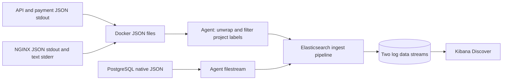

# Phase 6 — Centralized logging

The current Compose file also includes Phase 7 metrics. See the
[Phase 7 lesson](phase-07-metrics.md) for the added services and host measurement scope.

Logs explain individual failures, but switching between containers slows an
investigation. This phase puts application, proxy, and database events into one
searchable store. Collection runs outside the application's request path.

## What each component does

**Elastic Agent** supervises file readers that watch logs, track offsets, handle
rotation, and send batches. Its registry lets collection resume after replacing
the container. This lab uses standalone configuration from Git; production teams
can use Fleet to distribute policies to agents across many hosts.

**Elasticsearch** parses and indexes the events. An ingest pipeline extracts
timestamps, severity, IDs, and durations. Mappings determine which fields support
exact filters, numeric comparisons, or text search. Data streams group writes
into backing indices that roll over and expire. Production also needs replicas,
access controls, tested backups, and storage planning.

**Kibana** queries Elasticsearch and presents results. A data view describes which
indices to search and which field controls the time picker. It neither collects
logs nor copies them. Teams share saved searches and dashboards to make recurring
investigations easier.



Source mounts are read-only, and no Docker socket is mounted. The Docker mount
can read other projects' logs, but Agent publishes only the current project's
allowed services. PostgreSQL exposes only its log directory. Agent's own logs
are excluded to avoid a feedback loop. Earlier native Phase 3 database and
Phase 4 proxy files are outside this collection scope.

## Start and inspect

Use Linux containers and Compose with volume-subpath support; tested versions
are Engine 28.3.0 and Compose 2.38.1. Allocate roughly 6 GiB or more to Docker for
the combined lab, with extra headroom for other workloads. Elastic images need
several GiB of image storage. The 512 MiB Elasticsearch heap is only part of its
2 GiB container memory limit.

```bash
bash elastic/prepare-docker-logs.sh
docker compose up --build -d --wait --wait-timeout 360
docker compose ps --all
docker compose exec elastic-agent elastic-agent status
curl -s http://127.0.0.1:9200/_cluster/health
```

`db-init` and `elastic-setup` should exit successfully; seven other services stay
running. The three Elastic components use matching, digest-pinned 9.5.4 images.
The telemetry network is separate from the application network. Loopback ports
are 8088 for NGINX, 9200 for Elasticsearch, and 5601 for Kibana. Override them with
`SHOPSPHERE_PORT`, `ELASTICSEARCH_PORT`, and `KIBANA_PORT` if needed.

Elasticsearch and Kibana have no authentication or TLS in this local lesson.
Production needs authenticated ingestion, encrypted connections, restricted
access, and secrets management before external exposure.

Setup waits for Elasticsearch and Kibana, installs the pipeline, template,
lifecycle policy, data streams and data view, then permits Agent startup.
Application readiness does not depend on this stack. Agent health alone cannot
prove delivery; search for a newly generated request ID.

The helper creates an external Docker volume pointing at the daemon's container
directory. On Desktop/WSL it uses Docker Desktop's Windows CLI because WSL's
`/var/lib/docker` can belong to a different distro. The volume definition persists
across restarts, and Agent mounts it read-only. Native Linux uses its regular
Docker CLI. See [Agent setup](../elastic/README.md) for custom names and paths.

## Follow a payment

```bash
curl -i -H 'X-Request-ID: phase6-payment' http://127.0.0.1:8088/payment
```

Open [Kibana Discover](http://127.0.0.1:5601/app/discover), choose **ShopSphere logs**,
and select **Last 15 minutes**. Allow a few seconds for collection/index refresh,
then search using Kibana Query Language (KQL):

```text
request_id: "phase6-payment"
```

Add `service.name`, `event.action`, `log.level`, `event.duration`, and `message`
as columns. Expect NGINX, `order-api`, and `mock-payment` events. The application
explicitly propagates the ID. There are no spans or parent/child relationships
yet; a request ID is not an OpenTelemetry trace ID.

The equivalent direct Elasticsearch query is:

```bash
curl -s http://127.0.0.1:9200/logs-shopsphere.*-lab/_search \
  -H 'Content-Type: application/json' \
  -d '{"size":50,"query":{"term":{"request_id":"phase6-payment"}},"sort":[{"@timestamp":"asc"}]}'
```

## Parsing, normalization, and indexing

Docker wraps a stdout/stderr line in JSON containing `log`, `stream`, `time`, and
configured Compose labels. Agent decodes the wrapper and filters the project.
Elasticsearch then parses the inner JSON or NGINX's native error text. PostgreSQL
JSON is read directly from its files.

| Source | Search field | Reason |
| --- | --- | --- |
| `time`, `timestamp`, NGINX date | `@timestamp` | One event-time timeline |
| Service identity | `service.name` | Consistent service filters |
| `level`, `error_severity`, NGINX severity | `log.level` | Shared severity filters |
| Application `event` | `event.action` | Avoid string/object mapping conflicts |
| Request ID or SQL comment | `request_id` | Exact correlation |
| App/SQL milliseconds, NGINX seconds | `event.duration` in nanoseconds | Comparable duration filters |
| HTTP method/status | `http.request.method`, `http.response.status_code` | Method grouping and numeric status filters |

IDs are keywords, status is an integer, and duration is a long integer. `message`
supports text search. Extra fields stay in `_source` without adding mappings
automatically. `event.original` stores the raw line but is not indexed.
Malformed records retain their original text with `tags: parse_error` and
`error.message`. A parser failure is distinct from an application error.

The two data streams are `logs-shopsphere.container-lab` and
`logs-shopsphere.postgresql-lab`. Each backing index has one primary shard and no
replica for this single-node lesson. This provides persistence, not redundancy.

## Investigate SQL and errors

```bash
curl -H 'X-Request-ID: phase6-slow' http://127.0.0.1:8088/slow-query
curl -H 'X-Request-ID: phase6-error' http://127.0.0.1:8088/error
```

Search `request_id: "phase6-slow"`. Find the API's query event, the native
PostgreSQL slow statement, and HTTP completion/access events. The database's
request ID comes from the SQL comment. Its `event.duration` is at least
5,000,000,000 ns. Connection events have no request ID because a pooled connection
can serve many requests.

Search `request_id: "phase6-error"`. The application error includes a stack trace;
the completion and access events show HTTP 500. An application error normally
does not cause a native proxy error. To inspect an actual proxy failure:

```bash
docker compose stop api
curl -i -H 'X-Request-ID: phase6-proxy-error' http://127.0.0.1:8088/products
docker compose start api
```

Expect 502 or 504. Find the access event by request ID, then search native
`event.action: "proxy.error"` by its `nginx.connection`, container, and time
window. Native NGINX errors have no request ID. Keep-alive means one connection
can carry several requests, so the connection alone is insufficient.

Useful additional KQL filters:

```text
service.name: "postgresql" and event.action: "database.slow_statement"
log.level: "error"
http.response.status_code >= 500
event.duration >= 5000000000
tags: "parse_error"
```

## Persistence, outages, and retention

The volumes have distinct roles: `postgres_data` stores orders and source
database logs, `elasticsearch_data` stores indexed events and Kibana saved
objects, and `elastic_agent_state` stores collection progress. `down` retains
them; `down --volumes` deletes them. A normal startup problem does not require
deleting volumes.
The external `shopsphere_docker_logs` volume is a read-only view of Docker's source
directory. Compose does not delete it, and it does not duplicate those files.

Docker uses a 1024-byte file fingerprint to include unique timestamps/labels
beyond common startup text. PostgreSQL uses 64 bytes beginning with its timestamp.
Files below those thresholds wait to grow. Keep input IDs and fingerprint settings
stable to avoid replay. Agent can retry during brief output outages while source
files remain available. Unacknowledged batches can duplicate after failure; files
removed or rotated away before collection can be lost. The lab's publishing queue
is in memory, not a durable message broker.

Docker retains three 10 MB files per container, removed with that container.
PostgreSQL rotates daily or at 10 MB but does not delete old source files yet;
monitor its volume and arrange archival/cleanup for extended use. Elasticsearch
rolls backing indices after one day or a 1 GiB primary shard and deletes them
seven days after rollover. Lifecycle processing is asynchronous: this is not a
strict seven-day event TTL, and it does not delete source files.

## Verify and reflect

```bash
python3 tests/logging_smoke.py
python3 tests/compose_smoke.py --no-build
.venv/bin/python -m pytest -q
```

The logging script uses a unique project and temporary ports, then removes only
its own resources. It checks parsing, mappings, idempotent setup, the data view,
business/payment/error/SQL events, native proxy errors, filtering, Agent
replacement, and Elasticsearch outage/persistence. Allow RAM for a second Elastic
stack or temporarily stop the regular lab's telemetry services. The Phase 5 smoke
script starts only application services.

Explain why a data view cannot collect logs, why Docker requires two parsing
steps, why duration units matter, and why the registry and Elasticsearch volume
solve different persistence problems. Find one payment and one slow query across
services without opening `docker compose logs`.

Next: Phase 7 metrics, Prometheus exporters, and Grafana. Tracing remains Phase 8.

References: [Agent containers and state](https://www.elastic.co/docs/reference/fleet/elastic-agent-container),
[filestream](https://www.elastic.co/docs/reference/beats/filebeat/filebeat-input-filestream),
[standalone configuration](https://www.elastic.co/docs/reference/fleet/configure-standalone-elastic-agents),
and [index rollover](https://www.elastic.co/docs/manage-data/lifecycle/index-lifecycle-management/rollover).
