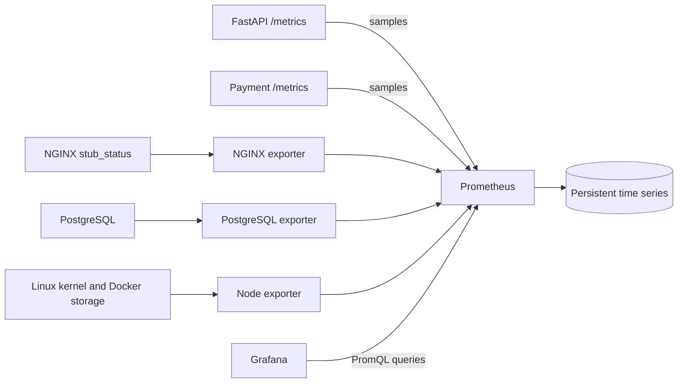

# Phase 7 — Metrics with Prometheus and Grafana

This phase measures the application, proxy, database, and Linux Docker host.
Prometheus collects samples; Grafana turns them into three provisioned dashboards.
The request path and Phase 6 logging continue to work independently of this stack.
Application images are version 0.7.0. Distributed tracing remains Phase 8.

## What moves through the pipeline



The arrows show measurement flow. Prometheus initiates HTTP requests every five
seconds: this is the **pull model**. An exporter translates a system's statistics
into the Prometheus exposition format. Python uses `prometheus-client` directly,
so an additional application exporter process is unnecessary.

A time series is a metric name plus its labels. Each scrape adds a timestamp and
value. For example, `http_requests_total{service="order-api",method="GET",
route="/products",status="200"}` counts one class of completed requests.
Prometheus adds `job` and `instance` labels from its scrape configuration.

## Start and explore

From the repository root in Bash/WSL:

```bash
bash elastic/prepare-docker-logs.sh
docker compose up --build -d --wait --wait-timeout 360
docker compose ps --all
```

The log helper safely reuses its external source volume. It does not load `.env`;
export a custom `DOCKER_LOG_VOLUME` before running it and use the same value in
Compose. Desktop/WSL uses the Windows Docker CLI after checking daemon identity.
Node exporter reuses this same volume to measure Docker storage capacity.
Prepare it even when running metrics without the Elastic services.

Open [Prometheus](http://127.0.0.1:9090) and [Grafana](http://127.0.0.1:3000).
The initial Grafana login is `admin` / `shopsphere_local`, configurable through
`GRAFANA_ADMIN_USER` / `GRAFANA_ADMIN_PASSWORD` before creating its data volume.
This is a local lab account. Anonymous access and account registration are disabled.
All published web ports bind to loopback; TLS is not enabled in this lab.

Grafana's **ShopSphere** folder contains:

- **Application**: request rate, response status, p95 and mean latency, server
  errors, and scrape health.
- **Database**: connections, transactions, application SQL executions and p95,
  row activity, buffer hit ratio, and exporter/database health.
- **Infrastructure**: Linux CPU, memory, Docker storage capacity, disk I/O, NGINX
  aggregate requests/connections, and collection health.

The `shopsphere-prometheus` data source and stable dashboard UIDs are provisioned
from Git. Dashboard files are authoritative; edit the JSON to make lasting
changes. Grafana polls them every 30 seconds, including on WSL bind mounts.

To run just this phase's stack:

```bash
docker compose up --build -d --wait --wait-timeout 180 \
  nginx-exporter postgres-exporter node-exporter prometheus grafana
```

The exporters bring up their application dependencies. Elastic services are not
required for metrics. Conversely, `docker compose up -d --wait nginx` starts only
the application and needs no external source volume.

## Counters, gauges, and histograms

| Kind | Behavior | Example and interpretation |
| --- | --- | --- |
| Counter | Increases until the process/statistics reset | `http_requests_total`: use `rate()` for requests per second |
| Gauge | Can increase or decrease | `pg_stat_database_numbackends`: current connections |
| Histogram | Counts observations in cumulative buckets, plus sum/count | `http_request_duration_seconds`: estimate percentiles or calculate a mean |

The application exports four metric families:

| Metric | Labels | Measurement boundary |
| --- | --- | --- |
| `http_requests_total` | service, method, route, status | One completed HTTP response |
| `http_request_duration_seconds` | service, method, route | ASGI request/response handling, including downstream waits |
| `application_errors_total` | service, method, route | One increment per 5xx response; 4xx is excluded |
| `database_query_duration_seconds` | service, operation, outcome | SQLAlchemy cursor execution, success or error |

The SQL timer excludes pool checkout, transaction commit, and a connection failure
before cursor execution. It measures client-observed execution, including a
server wait. `/slow-query` uses real `pg_sleep`; a five-second SQL wait must appear
inside an HTTP response lasting at least five seconds.

Buckets span 5 ms through 30 seconds, with an automatic `+Inf` bucket. Prometheus
creates `_bucket`, `_sum`, and `_count` series. A p95 is an estimate within those
buckets, not the exact slowest request. With little traffic, latency quantiles
are noisy; no observations may produce gaps or `NaN`, not a measured zero.

Each application instance owns its registry, and each container runs one Uvicorn
process. Counters reset on process replacement. Scaling to multiple worker
processes requires a supported multiprocess setup or separate scrape targets;
this implementation must not be reused unchanged with `--workers > 1`.

## Labels and measurement scope

Route templates such as `/orders/{id}` merge all order IDs into one category.
Unknown paths use `unmatched`; nonstandard HTTP methods and SQL operations use
`OTHER`. Request IDs, order IDs, query strings, raw SQL, and exception messages
never become metric labels. Each additional label combination creates more
stored series, so unbounded values cause **cardinality** growth.

`/metrics` requests do not count themselves. Existing readiness probes still call
`/products` and `/`, so their ordinary requests and SQL are included. This keeps
the existing health checks meaningful but gives an idle lab a small baseline.
The payment service exports its own HTTP families under `service="mock-payment"`.
Its unused database histogram has no observations.

NGINX exposes `stub_status` on internal port 8089. The exporter uses that listener;
port 8089 and all three exporter ports have no host mapping. Open-source
`stub_status` provides aggregate requests and connection states, not per-route
latency or status-code metrics. Its counts include health and status scrapes.
Use application metrics and NGINX logs for the more detailed request evidence.

The PostgreSQL exporter uses the separate `shopsphere_metrics` login with
`pg_monitor`, not the application's administrative login. The idempotent
`metrics-db-init` job adds that role to existing volumes. It grants no reads of
ShopSphere order/product tables. Monitoring privileges still expose database
statistics and activity; they are not suitable for an untrusted tenant.
Transactions and rows in the database dashboard are labeled accurately: neither
is a count of SQL statements. Application SQL histogram counts supply that view.
No `pg_stat_statements` extension or raw SQL labels are required.

Node exporter uses native CPU, memory, disk I/O, and kernel identity collectors.
Its normal `/proc` and `/sys` expose global Linux kernel counters: the Docker host
on native Linux, or the Linux VM on Docker Desktop. They do not describe Windows
or individual container resource limits. No host root, proc/sys bind, host PID
namespace, or Docker socket is needed for these collectors.

For capacity, the container reuses the existing non-recursive Docker log source
volume at `/docker-storage:ro`. `host-filesystem.sh` runs `stat` on that directory
every five seconds and atomically publishes `shopsphere_docker_storage_size_bytes`
and `shopsphere_docker_storage_avail_bytes` through the textfile collector. These
gauges measure the filesystem containing Docker's logs, normally Docker's data
disk. They do not measure the total size of the log files or all host filesystems.
The native filesystem collector is disabled because some WSL Windows-share mount
metadata cannot be parsed. Collection success, textfile parse errors, and sample
age expose failed or stale capacity measurements.

The collector runs as UID 65534, with capabilities dropped and a read-only root
filesystem. The log source volume is read-only; files accessible to that UID
remain accessible to this trusted collector. It writes only to a temporary
textfile directory. The same log-volume helper used by Elastic must run before
starting metrics, even when Elastic services are stopped.

## Generate evidence and query it

```bash
curl -s http://127.0.0.1:8088/metrics
curl -H 'X-Request-ID: phase7-slow' http://127.0.0.1:8088/slow-query
curl -H 'X-Request-ID: phase7-error' http://127.0.0.1:8088/error
curl -H 'X-Request-ID: phase7-payment' http://127.0.0.1:8088/payment
```

Allow at least two scrapes for a rate. Generate more requests over a minute to
make the graphs easier to interpret. Use these queries in Prometheus:

```promql
sum by (service, route) (rate(http_requests_total[1m]))

histogram_quantile(0.95,
  sum by (le, service, route) (rate(http_request_duration_seconds_bucket[1m])))

sum(rate(http_request_duration_seconds_sum{route="/slow-query"}[1m]))
/
sum(rate(http_request_duration_seconds_count{route="/slow-query"}[1m]))

sum by (service, route) (rate(application_errors_total[1m]))

up
```

Apply `rate` before aggregating counters so individual resets are handled. The
histogram quantile must retain `le`, the bucket upper-bound label, when summing.
Grafana uses `$__rate_interval`, which adapts the range to the graph and the
configured five-second scrape interval.

`up=1` means the scrape succeeded. It does not prove business readiness. Stop
PostgreSQL and `/metrics` stays readable while `/products` returns 503. Look at
`pg_up` for database connectivity and `pg_exporter_last_scrape_error` for collection
failures. `nginx_up` and `node_scrape_collector_success` similarly describe source
collection separately from exporter reachability. Restore stopped services after
an exercise with `docker compose start <service>`.

Use the same request IDs in Kibana to inspect event details. Metric labels cannot
identify that individual request; trace correlation remains a later phase.

## Persistence, failures, and validation

`prometheus_data` retains the time-series database/WAL; `grafana_data` retains
users, preferences, and its database. Replacing containers preserves these named
volumes. Source configuration and dashboard JSON remain version controlled.
Prometheus keeps data for seven days or 512 MB of retained blocks, whichever limit
is reached first. This is not a strict filesystem quota: active head data, the
WAL, and block compaction require additional space.

Application requests continue when Prometheus/Grafana stop. Scrapes missed during
an outage are not backfilled. A later counter sample can include intervening
increments if the application survived, but event timestamps and intermediate
gauge values are lost. Counter resets during the gap can lose those increments.
Deleting data volumes erases stored history and Grafana account changes.

```bash
.venv/bin/python -m pytest -q
python3 tests/metrics_smoke.py
python3 tests/compose_smoke.py --no-build
```

The metrics smoke test creates an isolated project and temporary loopback ports.
It verifies all six targets, source health, monitoring-role privileges, real
counters/histograms, every dashboard query, Grafana's data source, dependency
outages, application independence, and persisted history after replacement.
It removes only its own data volumes and checks that collector removal leaves
other containers and the Docker API usable.
Use `--no-build` when images are current. The Phase 6 logging smoke test remains
separate and starts only the services it needs.

Production equivalents include authenticated/TLS endpoints, secret management,
restricted monitoring networks, discovery, scrape/resource budgets, replicas or
remote storage, alert rules, and backups. This phase deliberately uses a single
Prometheus and Grafana instance with no alert delivery configured.

## Checkpoint and sources

Explain why a counter is not a rate, why p95 needs buckets, why `up` differs from
`pg_up`, what resets when an API process restarts, and which machine the host
panels describe. Then cause a slow query and a server error and find both in the
metrics dashboards and in Kibana.

Primary references:

- [Prometheus metric types](https://prometheus.io/docs/concepts/metric_types/)
- [Python client histograms](https://prometheus.github.io/client_python/instrumenting/histogram/)
- [PromQL functions](https://prometheus.io/docs/prometheus/latest/querying/functions/)
- [PostgreSQL exporter](https://github.com/prometheus-community/postgres_exporter)
- [NGINX exporter](https://github.com/nginx/nginx-prometheus-exporter)
- [Node exporter container deployment](https://github.com/prometheus/node_exporter)
- [Grafana provisioning](https://grafana.com/docs/grafana/latest/administration/provisioning/)

Next: Phase 8 adds OpenTelemetry spans, propagation, Collector, and Jaeger.
