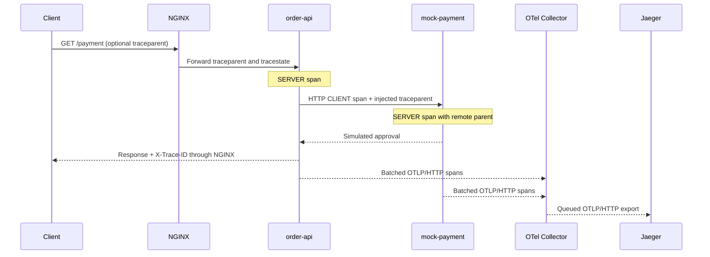

# Phase 8 — Distributed tracing with OpenTelemetry and Jaeger

A trace explains where one request spent its time. This phase connects FastAPI
server spans, SQL execution spans, an HTTP client span, and the payment service's
server span. Logs and Prometheus metrics continue to work independently.
Application and NGINX images are version 0.8.0.

## Follow one request



The network request and telemetry delivery are separate operations. The SDK's
background worker sends completed spans to the Collector; requests do not wait
for Jaeger. A payment trace has three spans across two service identities:

```text
order-api: GET /payment                  SERVER
└── order-api: GET                       CLIENT
    └── mock-payment: GET /payment       SERVER
```

For `/slow-query`, the API server span contains a PostgreSQL client span. The
span originates in the API process around SQLAlchemy cursor execution. There is
no SDK inside PostgreSQL and no database-server span. NGINX forwards W3C headers
but does not create proxy spans; its time remains visible through proxy metrics
and logs. API server timing therefore excludes time spent reaching the API.

## Spans, traces, and context

A **span** has a name, start/end timestamps, span ID, attributes, status, and
optional events. A **trace** groups spans under a 128-bit trace ID. Each child
records its parent's span ID, preserving causality across processes.

W3C `traceparent` carries version, trace ID, parent span ID, and trace flags:

```text
00-11111111111111111111111111111111-2222222222222222-01
```

The API validates incoming context using the OpenTelemetry propagator. It creates
a new trace when context is absent or malformed. HTTPX injects the outgoing
client span's context; the payment server extracts it. `tracestate` carries
vendor-specific state, not business payloads. A caller-supplied request ID remains
separate from the trace ID and cannot choose a trace by itself.

The SDK uses parent-based sampling with all new root traces sampled for this lab.
An incoming valid `00` sampling flag is respected: the response still has a trace
ID, but its spans are not exported. Seeing `X-Trace-ID` alone does not prove that
a trace was sampled, delivered, or retained. Production should set an intentional
sampling and external-context trust policy appropriate to its traffic.

## Start and inspect

The existing full-stack startup includes tracing:

```bash
bash elastic/prepare-docker-logs.sh
docker compose up --build -d --wait --wait-timeout 360
```

To run only the application and tracing services, no external log-source volume
is needed:

```bash
docker compose up --build -d --wait --wait-timeout 180 \
  nginx otel-collector jaeger
curl -s http://127.0.0.1:16686/api/v3/services
```

Open [Jaeger](http://127.0.0.1:16686). Choose `order-api`, select a recent time
range, and search after generating requests. The Collector and Jaeger use minimal
images without shell-based Docker health probes; `compose --wait` confirms their
process startup. The query API and the tracing smoke test verify actual readiness
and delivery. Collector health is available internally at port 13133.

```bash
curl -i http://127.0.0.1:8088/payment
curl -i http://127.0.0.1:8088/slow-query
curl -i http://127.0.0.1:8088/error
```

Copy the response's `X-Trace-ID` into Jaeger's trace-ID search. A direct UI link is
`http://127.0.0.1:16686/trace/<trace-id>`. Allow a few seconds for SDK/Collector
batching and storage. With this pinned Jaeger version, service discovery uses
`/api/v3/services`. Trace retrieval uses `/api/v3/traces/<trace-id>` and returns
streamed JSON envelopes containing OTLP resource spans.

To demonstrate a remote parent through the proxy:

```bash
curl -i -H 'traceparent: 00-11111111111111111111111111111111-2222222222222222-01' \
  -H 'tracestate: lab=lesson' http://127.0.0.1:8088/payment
```

The supplied parent span is not exported by this curl command, so the trace has
an external parent with no stored span. Use a different trace ID for each new
exercise to avoid merging unrelated requests.

## What instrumentation measures

| Span | Instrumentation | Boundary |
| --- | --- | --- |
| API/payment HTTP server | OpenTelemetry FastAPI integration | ASGI request through response completion |
| Outbound payment HTTP | OpenTelemetry HTTPX integration on that client | Downstream HTTP transport call |
| PostgreSQL client | Explicit SQLAlchemy event hooks | Cursor execution until success/error |

The SQL span excludes pool checkout, connection establishment, transaction
commit, and result fetching after cursor execution. It records operation,
database name, and host/port; it excludes SQL text, bound parameter values,
credentials, and the request-ID SQL comment. Startup schema/readiness queries
outside a request do not create orphan SQL spans.

FastAPI copies context into the worker threads used by synchronous database
routes. Each app has its own provider and resource identity; instrumentation does
not replace the process-wide tracer provider or globally wrap every HTTP client.
The SDK exporter starts with the app lifespan and drains on graceful shutdown.
Native runs remain uninstrumented unless `OTEL_EXPORTER_OTLP_TRACES_ENDPOINT` is
exported. It must be a reachable OTLP/HTTP URL ending in `/v1/traces`. Compose
sets `http://otel-collector:4318/v1/traces`; the receiver is not host-published.
Set `OTEL_SDK_DISABLED=true` when recreating app containers to disable tracing.

`/metrics` is excluded from server tracing, avoiding self-observation noise.
Ordinary `/products` and `/` health probes still generate spans. Receive/send
implementation spans are suppressed, leaving the meaningful operations above.
Request headers and bodies are not captured. URLs and exception events can still
contain application information; review telemetry content before production use.

The logging middleware records unhandled request exceptions before
returning its existing JSON 500 response. The server span marks 5xx failures;
HTTPX marks downstream failures, and SQL error spans record the exception type.
4xx server responses do not automatically become failed spans. Existing metrics
still count each server error once.

Application JSON logs now include the active `trace_id` and `span_id`; outside
trace context those values are null. The existing Elastic parser already maps
application `trace_id` to `trace.id`. NGINX and native PostgreSQL logs retain
request-ID correlation rather than inventing their own trace/span identity.
Phase 9 will develop the complete cross-signal debugging workflow and links.

## Read the timeline correctly

A five-second `pg_sleep` must appear inside a server span lasting at least five
seconds. An extra 500 ms of sequential application work would make the total
about 5.5 seconds. The parent is an inclusive wall-clock interval; do not add its
full duration to its children's durations. Parallel child spans can overlap.

For `/payment`, the API server span contains the HTTP client wait, and the
payment server span lies within that client call when clocks agree. Separate
hosts can have clock skew; the test requests raw stored timings and runs the
containers on one Docker host. Jaeger may adjust display timing for skew.

## Collector, storage, and outage limits

The pipeline is **OTLP/HTTP receiver → memory limiter → batch processor →
OTLP/HTTP exporter**. The Collector bridges the app and telemetry networks;
Jaeger joins only the telemetry network. Only Jaeger's UI/query port 16686 is
published on loopback. The lab has no tracing authentication or TLS.

`tracing-storage-init` gives UID 10001 ownership of the two volume roots without
rewriting stored files. Collector and Jaeger run as that user with read-only root
filesystems and dropped capabilities. Their configuration pins Collector Contrib
0.162.0 and Jaeger 2.22.0 by digest. Jaeger v2 receives OTLP directly; no retired
Jaeger exporter or agent protocol is needed.

| Storage | Contents | Limit and failure behavior |
| --- | --- | --- |
| SDK process memory | Finished spans awaiting export | 2,048 spans; 128 per batch; short bounded export attempts; process crashes/outages can lose spans |
| Collector memory | Receiver/processor batches | Memory limiter and 256 MiB container budget; unqueued spans can be lost on crash |
| `otel_queue` volume | Exporter requests awaiting acknowledgement | 512 requests, 64 MiB queue database; retries transient failures while space remains |
| `jaeger_data` volume | Badger trace storage | 48-hour span TTL; single-node storage, not a strict disk quota |

The Collector queue survives replacement after requests are durably enqueued.
It does not make the whole pipeline lossless or exactly once: full queues,
permanent export errors, unpersisted batches, or ambiguous acknowledgements can
lose or duplicate spans. The smoke test verifies delivery of queued spans after
a Collector crash during a Jaeger outage. The SDK is not a durable spool.
Jaeger acknowledges its pipeline before all data necessarily reaches durable
storage; abrupt host failure has a wider loss window than a graceful replacement.

`docker compose stop` or ordinary `down` retains volumes. `down --volumes`
deletes trace history and queued exports alongside the other lab data. Badger
survives container replacement but has no replicas or backups and cannot serve
multiple Jaeger nodes sharing the same files. Production needs a suitable shared
storage backend, capacity planning, TLS/authentication, sampling, and backups.

## Verify and explain

```bash
.venv/bin/python -m pytest -q
python3 tests/tracing_smoke.py --no-build
docker compose run --rm --no-deps otel-collector validate --config=/etc/otelcol/config.yml
docker compose run --rm --no-deps jaeger validate --config=/etc/jaeger/config.yml
```

The isolated smoke project verifies proxy context propagation, HTTP parent-child
relationships, real slow SQL, failed spans, sampling, graceful SDK flush,
application independence during Collector downtime, persistent exporter queues,
and Jaeger history after replacement. It removes only its own containers/volumes.
The application, metrics, and logging smoke suites remain separate regressions.

Explain why the outbound HTTP client and payment server are different spans,
why PostgreSQL appears under `order-api`, why NGINX has no span, and why an
unsampled request can still return a trace ID. Then locate the slow SQL span and
the intentional exception in Jaeger.

Primary references:

- [OpenTelemetry Python instrumentation](https://opentelemetry.io/docs/languages/python/instrumentation/)
- [FastAPI instrumentation](https://opentelemetry-python-contrib.readthedocs.io/en/latest/instrumentation/fastapi/fastapi.html)
- [HTTPX instrumentation](https://opentelemetry-python-contrib.readthedocs.io/en/latest/instrumentation/httpx/httpx.html)
- [Collector file storage](https://github.com/open-telemetry/opentelemetry-collector-contrib/tree/v0.162.0/extension/storage/filestorage)
- [Jaeger Badger configuration](https://github.com/jaegertracing/jaeger/blob/v2.22.0/cmd/jaeger/config-badger.yaml)
- [Jaeger query API](https://github.com/jaegertracing/jaeger-idl/blob/main/proto/api_v3/query_service.proto)

Next: Phase 9 connects logs, metrics, and traces in complete debugging exercises.
