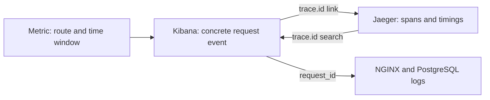

# Phase 9 — Correlate logs, metrics, and traces

The completed lab connects a metric trend to request logs and then to a trace.
Kibana's **ShopSphere logs** data view formats `trace.id` as a clickable Jaeger
link. No additional application instrumentation or image version is required;
the application images remain 0.8.0 from Phase 8.

## Start and verify the complete journey

Use the source-volume setup in the root README before the first Compose start.
For an existing lab, install the updated data-view formatter:

```bash
docker compose up -d
docker compose run --rm --no-deps elastic-setup
python3 tests/correlation_smoke.py
```

The correlation check creates **two retained demonstration orders**: one with a
one-second database delay and one without. It also calls the payment and error
routes. It prints a Markdown report with request IDs, measured response times,
log/span counts, order IDs, and links to Kibana and Jaeger. Save a copy if useful:

```bash
python3 tests/correlation_smoke.py > /tmp/shopsphere-correlation.md
```

This check uses the running stack and leaves its services running. Unlike the
isolated lifecycle smoke suites, it deliberately retains its small demonstration
orders and telemetry for exploration. It verifies logs from the relevant
services, matching trace IDs, slow SQL timing, failed-span status, the installed
Kibana formatter, and a Prometheus counter increase after scraping.

The default URLs are localhost ports 8088, 9200, 9090, 5601, and 16686. Override
`SHOPSPHERE_URL`, `ELASTICSEARCH_URL`, `PROMETHEUS_URL`, `KIBANA_URL`, and
`JAEGER_URL` for a custom setup. The browser-facing link is independently set by
`JAEGER_PUBLIC_URL` in `.env`; after changing it, rerun `elastic-setup`.

## Investigation 1: checkout became slow

1. Run the correlation check and note the slow and normal checkout request IDs.
2. Open [Grafana](http://127.0.0.1:3000), sign in with the lab credentials, and open
   **ShopSphere / Application**. Select the last 15 minutes. Locate the `/orders`
   latency change. **ShopSphere / Database** shows SQL timing in the same window.
3. Open [Kibana Discover](http://127.0.0.1:5601/app/discover), choose **ShopSphere
   logs**, and search for the slow request using the exact ID from the report:

   ```text
   request_id: "phase9-REPLACE_WITH_THE_PRINTED_ID"
   ```

4. Add `service.name`, `event.action`, `request_id`, `trace.id`, `event.duration`,
   and `message` as columns. API, NGINX, and PostgreSQL events share the request
   ID. The API's SQL event and the database slow-statement event explain the wait.
5. Click an API event's **trace.id**. Jaeger opens the matching trace. Expand the
   PostgreSQL `SELECT` client span inside the API `POST /orders` server span.
   The delayed cursor execution lasts at least one second.
6. Repeat the log/trace inspection for the normal checkout. Removing
   `db_delay_seconds` removes the injected SQL wait. Compare actual durations in
   the report and traces; host scheduling can still affect total latency.

The exercise changes a request parameter, not a query index or database schema.
Both orders are valid independent purchases in the local simulation. Creating
an order does not charge or invoke the mock payment service.

Use these PromQL expressions in Prometheus or Grafana Explore:

```promql
sum by (route) (rate(http_requests_total{service="order-api"}[5m]))
```

```promql
sum by (route) (rate(http_request_duration_seconds_sum{service="order-api"}[5m]))
/
sum by (route) (rate(http_request_duration_seconds_count{service="order-api"}[5m]))
```

```promql
histogram_quantile(0.95,
  sum by (le, route) (rate(http_request_duration_seconds_bucket{service="order-api"}[5m]))
)
```

Allow at least two scrapes for rates. A few demo requests may only cause a small
change in a five-minute aggregate. Histogram quantiles estimate latency from
buckets; a trace shows one request's measured operations. Readiness traffic is
included on its routes, and process replacement resets counters.

## Investigation 2: an application error

Use the report's **Intentional error** links. The API returns 500 and logs an
exception and completion event. NGINX records the upstream 500 as an access
event. The Jaeger server span has error status and an exception event.

```text
service.name: "order-api" and http.response.status_code: 500
```

```promql
sum by (route) (increase(application_errors_total{service="order-api"}[5m]))
```

The error counter locates an affected route and time window. Select a concrete
log event to obtain a trace ID; a counter does not identify one particular trace.
An API 500 passed through NGINX need not create a native proxy error-log entry.

## Investigation 3: the payment journey

The report's payment request has three spans: API server → HTTP client → payment
server. Both application services share a trace ID and have different span IDs.
The NGINX access event shares the request ID. Search `trace.id` to collect the
application events, or `request_id` to include the uninstrumented proxy boundary.

To investigate an actual downstream outage, follow the isolated recovery test:

```bash
python3 tests/tracing_smoke.py --no-build
```

It verifies 502/504 responses, failed spans, Collector independence, and recovery
using its own disposable project. The main stack remains available.

## What joins the signals



| Field or measurement | Meaning and boundary |
| --- | --- |
| `request_id` | Application correlation ID, also forwarded into SQL comments |
| `trace.id` | Distributed trace ID in Elasticsearch; `trace_id` in raw app JSON |
| `span_id` | Current application span in raw JSON; it can be the parent server span for SQL logs |
| Application `duration_ms` | Milliseconds in the original JSON log |
| Elasticsearch `event.duration` | Nanoseconds after normalization |
| Prometheus duration metrics | Seconds, aggregated over multiple requests |
| Jaeger span duration | One operation's elapsed time, shown with UI units |

Request and trace IDs are deliberately absent from metric labels to keep series
counts bounded. This lab uses route/time context to move from metrics to logs;
it does not claim exemplar-based metric-to-trace links. NGINX and PostgreSQL do
not emit native spans. PostgreSQL client spans are recorded inside the API.

## Missing links and learner checkpoint

If a trace link is absent, inspect an API or payment event and ensure tracing is
enabled. Native proxy/database events need the request-ID bridge. Unsampled
requests can have a trace ID without stored spans. Check time filters, async
export delay, Collector health, and Jaeger's 48-hour retention before assuming
propagation is broken. After changing the public port, update `JAEGER_PUBLIC_URL`
and rerun setup. Older logs can outlive the trace they refer to.

Explain which signal revealed the problem, which request demonstrates it, which
span consumed the time, and what evidence shows improvement. All nine Compose
learning phases are complete. Kubernetes, alerting, TLS, authentication, backups,
and high availability remain production extensions, not implemented features.

Reference: [Kibana data-view API and field formats](https://www.elastic.co/docs/api/doc/kibana/operation/operation-createdataviewdefaultw).
